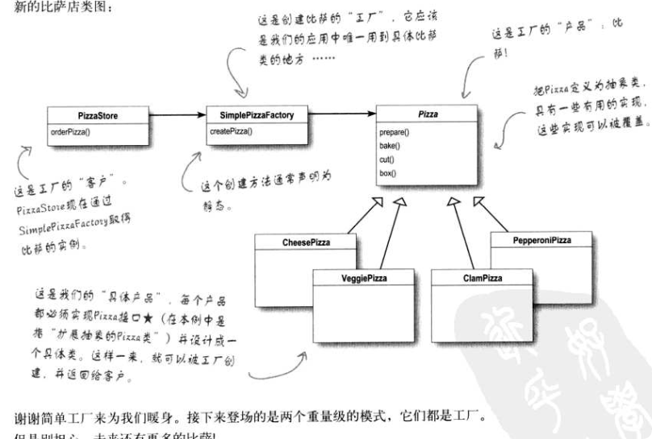

好的，我们接着来讲**简单工厂模式 (Simple Factory)**。

在您的课件（`8.Factory.pdf`）中，这一章节是通过一个**Pizza（比萨）店**的案例引出的。这是一个非常经典的案例，用来展示如何将“对象的创建”与“对象的使用”解耦。

### 1. 场景与问题：糟糕的“耦合”代码

假设我们开了一家 Pizza 店，最初的业务逻辑写在 `PizzaStore` 类中。当顾客点餐时，我们需要根据顾客的选择（type）来 `new` 出不同的 Pizza 对象，然后进行烘烤、切片、装盒。

**最初的实现（存在问题）：**

```java
public class PizzaStore {
    
    public Pizza orderPizza(String type) {
        Pizza pizza;

        // --- 变化的部分开始 ---
        // 这里的代码非常脆弱。如果我们要加一种新品种（比如 ClamPizza），
        // 或者下架一种旧品种（比如 GreekPizza），我们就必须修改这段代码。
        if (type.equals("cheese")) {
            pizza = new CheesePizza();
        } else if (type.equals("greek")) {
            pizza = new GreekPizza();
        } else if (type.equals("pepperoni")) {
            pizza = new PepperoniPizza();
        }
        // --- 变化的部分结束 ---

        // --- 不变的部分 ---
        // 无论是什么Pizza，制作流程是固定的
        pizza.prepare();
        pizza.bake();
        pizza.cut();
        pizza.box();

        return pizza;
    }
}
```

**课件指出的问题：**
*   **缺乏弹性**：`orderPizza` 方法不仅要负责“处理”Pizza（烘烤、切片等），还要负责“创建”Pizza。
*   **违反开闭原则**：每次菜单更新（增加或删除Pizza种类），你都必须打开 `PizzaStore` 的源码进行修改。这违反了“对扩展开放，对修改关闭”的原则。

### 2. 解决方案：封装变化

课件强调了一个核心设计原则：**找到系统中变化的部分，将它封装起来**。

在这里，变化的是“如何创建不同种类的 Pizza”。解决方案是把创建对象的逻辑从 `PizzaStore` 中剥离出来，放到一个专门的类中，这个类就叫做**工厂 (Factory)**。

### 3. 简单工厂的实现

我们创建一个新类 `SimplePizzaFactory`，它的唯一职责就是根据类型创建 Pizza。

#### A. 工厂类代码

```java
public class SimplePizzaFactory {
    // 这个方法通常也可以声明为 static（静态工厂方法）
    public Pizza createPizza(String type) {
        Pizza pizza = null;

        if (type.equals("cheese")) {
            pizza = new CheesePizza();
        } else if (type.equals("pepperoni")) {
            pizza = new PepperoniPizza();
        } else if (type.equals("clam")) {
            pizza = new ClamPizza();
        } else if (type.equals("veggie")) {
            pizza = new VeggiePizza();
        }
        
        return pizza;
    }
}
```

#### B. 重构后的客户端 (PizzaStore)

现在，`PizzaStore` 不再需要知道具体的 Pizza 类（如 `CheesePizza`）是如何创建的，它只需要持有一个工厂的引用。

```java
public class PizzaStore {
    SimplePizzaFactory factory;

    // 在构造函数中传入工厂
    public PizzaStore(SimplePizzaFactory factory) {
        this.factory = factory;
    }

    public Pizza orderPizza(String type) {
        Pizza pizza;

        // 核心改变：
        // 使用工厂来创建对象，而不是自己直接 new
        // PizzaStore 现在只关心从工厂拿到一个 Pizza，而不关心具体是哪一种
        pizza = factory.createPizza(type);

        // 后续处理逻辑保持不变
        pizza.prepare();
        pizza.bake();
        pizza.cut();
        pizza.box();

        return pizza;
    }
}
```

### 4. 简单工厂模式总结



根据课件的定义：

*   **定义**：简单工厂模式（也叫静态工厂方法模式）是由一个工厂类根据传入的参数，决定创建出哪一种产品类的实例。
*   **核心作用**：
    1.  **职责分离**：`PizzaStore` 负责“卖”比萨（业务逻辑），`SimplePizzaFactory` 负责“造”比萨（对象创建）。
    2.  **消除依赖**：客户端不再直接依赖于具体产品类（如 `CheesePizza`），而是依赖于抽象（`Pizza` 接口）和工厂。
*   **优点**：
    *   如果以后有多个类（例如不仅有 `PizzaStore`，还有 `PizzaDeliveryService`）都需要创建 Pizza，它们都可以复用这个工厂，而不需要在每个类里都写一遍 `if-else`。
    *   修改创建逻辑时，只需要修改工厂类一个地方。

这就是简单工厂模式，它是理解后续更复杂的**工厂方法模式**和**抽象工厂模式**的基础。

---

## 常见问题解答

### 问题一：简单工厂和一个函数的区别是什么？

你的直觉是对的：从代码执行的角度看，`SimplePizzaFactory` 里的 `createPizza` 方法确实就是一个普通的函数（或者方法）。把 `if-else` 逻辑从 `PizzaStore` 挪到 `SimplePizzaFactory` 里，看起来只是"把代码搬了个家"。

那么，为什么要多此一举搞个类呢？

这主要涉及三个核心原因：**解耦（Decoupling）**、**复用（Reusability）** 和 **单一职责（SRP）**。

#### 1. 彻底的解耦（最重要的一点）

**如果不使用工厂类（函数写在 PizzaStore 里）：**

`PizzaStore` 的代码里必须出现 `new CheesePizza()`, `new GreekPizza()`。这意味着 `PizzaStore` 类必须依赖（import）所有的具体 Pizza 类。

**后果：** 如果你要加一个 `ClamPizza`，你必须打开 `PizzaStore.java` 去修改代码。业务逻辑代码（Store）和创建代码（new）混杂在一起了。

**如果使用工厂类：**

`PizzaStore` 类里完全看不到 `CheesePizza` 这些具体的名字。它只知道 `Pizza`（接口）和 `SimplePizzaFactory`。

**后果：** `PizzaStore` 变成了"什么都不知道的傻瓜"，它只管卖比萨。如果你要加一种新比萨，你只需要去改工厂类，`PizzaStore` 的代码一行都不用动。这就是"对修改关闭"。

#### 2. 代码复用

**场景：** 假设你的系统里除了"比萨店（PizzaStore）"，还有一个"比萨外卖服务（PizzaDelivery）"类，或者一个"比萨菜单预览（PizzaMenu）"类。

**如果不独立出来：** 你就得在 `Store` 里写一遍 `if-else`，在 `Delivery` 里又写一遍 `if-else`。将来比萨种类一变，你要改三个地方，很容易漏掉。

**如果独立成工厂：** `Store`、`Delivery`、`Menu` 都可以调用同一个 `SimplePizzaFactory`。创建逻辑只在同一个地方维护。

#### 3. 单一职责原则 (SRP)

`PizzaStore` 的职责应该是"接单、处理订单流程"。

`Factory` 的职责是"管理对象的创建"。

如果不分开，`PizzaStore` 就"既当爹又当妈"，管得太宽了，类会变得很臃肿，难以维护。

**总结：** 简单工厂不仅仅是"把函数挪个位置"，它是为了切断"业务逻辑"与"具体产品"之间的直接联系。

---

### 问题二：为什么类图里面这几个类是相互连接的，也不是继承啊？

这也是初学者看 UML 类图最容易晕的地方。在类图中，类与类之间的连线（关系）不仅仅只有继承（Extends/Inherits）。

类图里常见的连线有三种主要含义：

#### 1. 关联 (Association) —— "我拥有你" (Has-a)

这是最常见的一种连接（通常是实线箭头）。

**代码表现：** 类 A 有一个成员变量是 类 B。

**本例中：** `PizzaStore` 和 `SimplePizzaFactory` 就是这种关系。

```java
public class PizzaStore {
    SimplePizzaFactory factory; // 成员变量，长期持有
    // ...
}
```

**解释：** `PizzaStore` 知道工厂的存在，并且长期持有它，以便随时使用。这叫"关联"。

#### 2. 依赖 (Dependency) —— "我用到了你" (Uses-a)

这是比关联更弱的一种关系（通常是虚线箭头）。

**代码表现：** 类 A 的某个方法参数是 类 B，或者在方法里局部变量 `new` 了一个 类 B。

**本例中：** `SimplePizzaFactory` 和具体的 `CheesePizza` 就是这种关系。

```java
public class SimplePizzaFactory {
    public Pizza createPizza(String type) {
        if (type.equals("cheese")) {
            return new CheesePizza(); // 临时用一下，创建出来就扔出去了
        }
        // ...
    }
}
```

**解释：** 工厂类为了创建对象，必须"认识"具体的 Pizza 类。如果 `CheesePizza` 消失了，工厂就会报错。所以工厂依赖于具体 Pizza。

#### 3. 泛化/实现 (Generalization/Realization) —— "我是你" (Is-a)

这才是你提到的继承。

**本例中：** `CheesePizza` 继承 `Pizza`。这是实线空心三角形箭头。

#### 重新审视这几张图的连接

如果你看的是标准的简单工厂 UML 图：

*   **PizzaStore -> SimplePizzaFactory (实线)：**
    *   意思：`PizzaStore` 持有 一个工厂引用。
*   **SimplePizzaFactory -> Pizza (虚线)：**
    *   意思：工厂 生产 Pizza（依赖）。
*   **PizzaStore -> Pizza (实线/虚线)：**
    *   意思：`PizzaStore` 使用 Pizza 来做 `prepare`/`bake` 等操作。
*   **CheesePizza -> Pizza (带空心三角的实线)：**
    *   意思：这是 继承。

**结论：** 类图里的连线是为了告诉你**"谁认识谁"**。

*   `PizzaStore` 认识 `Factory`。
*   `Factory` 认识 `CheesePizza`。
*   **最关键的是：** `PizzaStore` 不认识 `CheesePizza`（它们之间没有连线）。这就是设计模式的威力——把它们隔开了。
