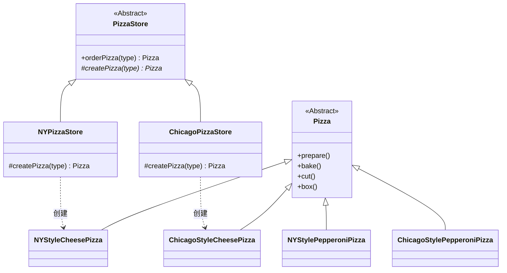
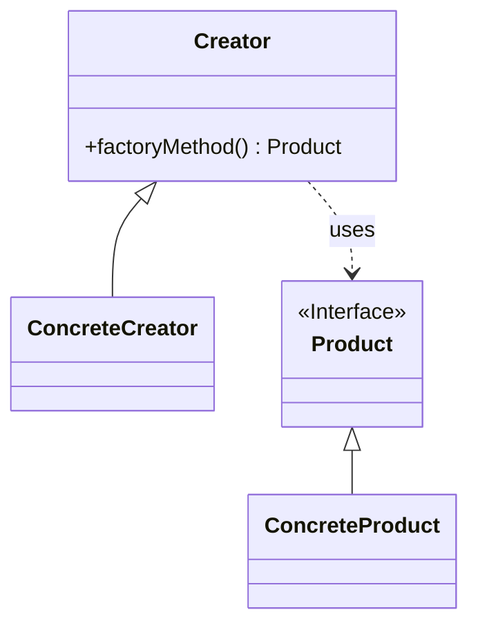
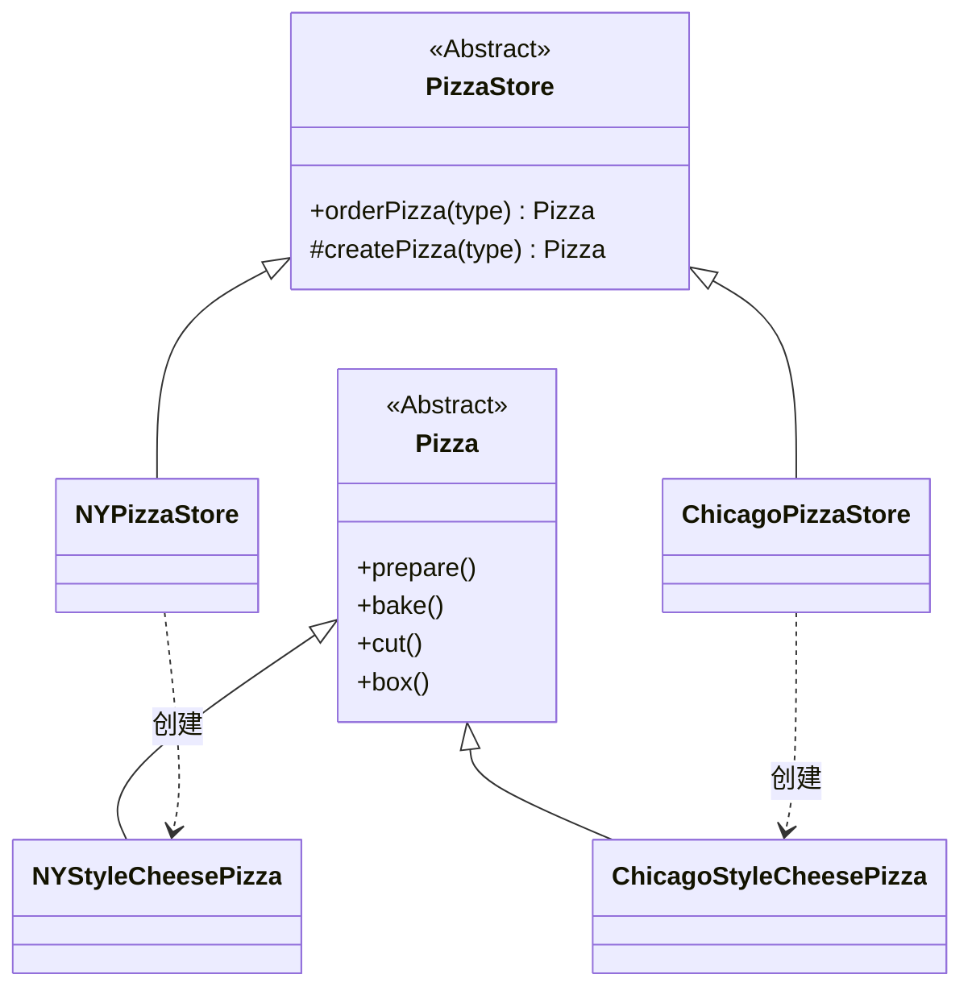
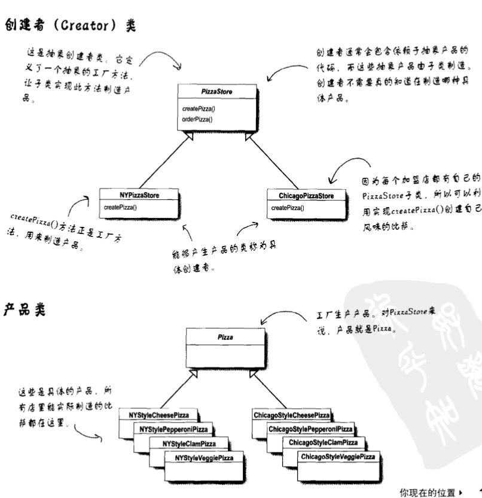

# 工厂方法模式 (Factory Method Pattern)

## 概述

好的，我们继续深入。在讲完简单工厂后，课件（`8.Factory.pdf`）引入了一个新的挑战，从而引出了**工厂方法模式 (Factory Method Pattern)**。

这一章节的核心在于解决**"如何在保持标准流程控制的同时，允许不同地区有个性化的实现"**。

## 1. 场景升级：加盟店与风味差异

假设你的 Pizza 店非常成功，开始在不同地区开分店（加盟）。
*   **纽约店 (NYStyle)**：顾客喜欢薄饼（Thin Crust）和少许酱料。
*   **芝加哥店 (ChicagoStyle)**：顾客喜欢深盘厚饼（Deep Dish）和大量酱料。

**遇到的问题：**
如果你继续使用之前的 `SimplePizzaFactory`，你就需要写很多 `if-else` 来判断是“纽约风味”还是“芝加哥风味”。更重要的是，作为总店，你希望控制 Pizza 的制作流程（`prepare`, `bake`, `cut`, `box` 必须按顺序执行），但你必须允许分店自己决定如何“创建”具体的 Pizza（比如纽约店创建的是 `NYStyleCheesePizza`）。

## 2. 解决方案：工厂方法

课件中采取的办法是：**把 `createPizza` 方法放回 `PizzaStore` 中，但把它声明为“抽象方法”**。

这样一来，`PizzaStore` 就变成了一个**框架 (Framework)**：
1.  它在 `orderPizza` 方法中定义了**标准流程**。
2.  它把**具体的创建步骤**（`createPizza`）推迟到子类（如 `NYPizzaStore`）去实现。

## 3. 代码实现

### A. 抽象的创建者 (Abstract Creator)

`PizzaStore` 现在是一个抽象类。

```java
public abstract class PizzaStore {
 
    // orderPizza 是由框架实现的，它不仅调用了创建方法，还规定了后续流程
    // 加上 final 防止子类修改这个流程（可选，但推荐）
    public final Pizza orderPizza(String type) {
        Pizza pizza;
 
        // 关键点：这里调用的是抽象方法。
        // 父类不知道具体会造出什么Pizza，但它知道Pizza造出来后该怎么处理。
        pizza = createPizza(type);
 
        pizza.prepare();
        pizza.bake();
        pizza.cut();
        pizza.box();
 
        return pizza;
    }
 
    // --- 这就是“工厂方法” ---
    // 它是抽象的，必须由子类实现。
    // 它的作用是：隔离了客户代码（orderPizza）和具体产品代码（NYStyleCheesePizza）。
    protected abstract Pizza createPizza(String type);
}
```

### B. 具体的创建者 (Concrete Creator)

每个地区都有自己的子类，负责实现“怎么造Pizza”。

**纽约分店：**

```java
public class NYPizzaStore extends PizzaStore {

    // 实现父类的抽象方法
    @Override
    protected Pizza createPizza(String type) {
        if (type.equals("cheese")) {
            // 创建的是纽约风味的芝士比萨
            return new NYStyleCheesePizza();
        } else if (type.equals("veggie")) {
            return new NYStyleVeggiePizza();
        } else if (type.equals("clam")) {
            return new NYStyleClamPizza();
        } else if (type.equals("pepperoni")) {
            return new NYStylePepperoniPizza();
        } else {
            return null;
        }
    }
}
```

**芝加哥分店：**

```java
public class ChicagoPizzaStore extends PizzaStore {

    @Override
    protected Pizza createPizza(String type) {
        if (type.equals("cheese")) {
            // 创建的是芝加哥风味的芝士比萨（深盘）
            return new ChicagoStyleCheesePizza();
        } 
        // ... 其他类型
        return null; 
    }
}
```

### C. 具体的产品 (Concrete Product)

具体的 Pizza 类也需要体现地区差异。

```java
public class NYStyleCheesePizza extends Pizza {
    public NYStyleCheesePizza() {
        name = "NY Style Sauce and Cheese Pizza";
        dough = "Thin Crust Dough"; // 薄饼
        sauce = "Marinara Sauce";   // 大蒜番茄酱
        // ...
    }
}

public class ChicagoStyleCheesePizza extends Pizza {
    public ChicagoStyleCheesePizza() {
        name = "Chicago Style Deep Dish Cheese Pizza";
        dough = "Extra Thick Crust Dough"; // 厚饼
        sauce = "Plum Tomato Sauce";       // 李子番茄酱
    }
    
    // 芝加哥Pizza切法可能不同（切成方块），可以重写cut方法
    @Override
    void cut() {
        System.out.println("Cutting the pizza into square slices");
    }
}
```

## 4. 客户端如何使用

现在，如果我想吃纽约风味的皮萨：

```java
public class PizzaTestDrive {
    public static void main(String[] args) {
        // 1. 先建立一个纽约店的实例（向上转型为PizzaStore）
        PizzaStore nyStore = new NYPizzaStore();
        
        // 2. 建立一个芝加哥店的实例
        PizzaStore chicagoStore = new ChicagoPizzaStore();
 
        // 3. 下单：调用的是父类的 orderPizza
        // 但内部的 createPizza 会多态地调用 NYPizzaStore 的实现
        Pizza pizza = nyStore.orderPizza("cheese");
        System.out.println("Ethan ordered a " + pizza.getName() + "\n");
 
        // 4. 下单芝加哥风味
        pizza = chicagoStore.orderPizza("cheese");
        System.out.println("Joel ordered a " + pizza.getName() + "\n");
    }
}
```

## 5. 工厂方法模式总结

### 类图



**通用类图（模式角色）**



**当前示例类图（PizzaStore / NYPizzaStore）**



**Head First 书中原图：**



课件中对**工厂方法模式**的官方定义是：

> **定义一个用于创建对象的接口（这里指抽象方法），让子类决定实例化哪一个类。工厂方法使一个类的实例化延迟到其子类。**

**与简单工厂的区别：**
*   **简单工厂**：把创建逻辑封装在一个**对象**（类）中。如果增加新产品，需要修改这个类。
*   **工厂方法**：通过**继承**来实现。把创建逻辑放到了子类中。如果增加新风味（比如加州风味），只需要新增一个 `CaliforniaPizzaStore` 子类，而不需要修改现有的 `PizzaStore` 代码。这完美符合**开闭原则**。

**核心结构：**
*   **平行的类层级结构**：`PizzaStore` 对应 `Pizza`；`NYPizzaStore` 对应 `NYStylePizza`。