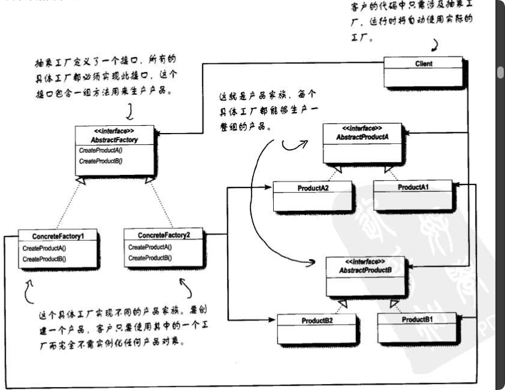
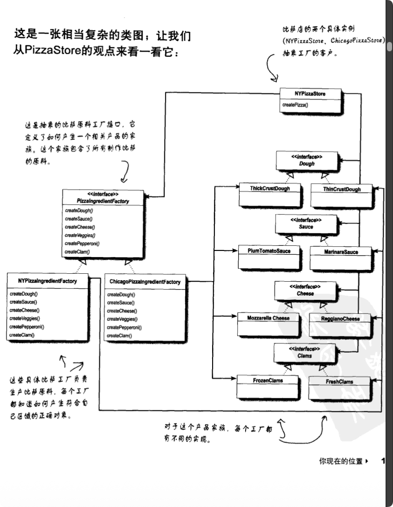

好的，我们进入创建型模式的最终章：**抽象工厂模式 (Abstract Factory Pattern)**。

在《Head First 设计模式》中，这个模式通过**Pizza 原料工厂**的例子来讲解。这个模式是为了解决**"产品族"**（Product Family）的问题。

### 1. 场景：原料族的约束

在此之前，工厂方法模式解决的是生产"一个产品"（比如一个 Pizza）的问题。

现在假设我们要制作不同风味的 Pizza。Pizza 由多种原料组成，比如**面团 (Dough)**、**酱料 (Sauce)**、**芝士 (Cheese)**、**蔬菜 (Veggies)**、**蛤蜊 (Clams)** 等。
*   **约束条件**：如果你要做 **纽约风味 (NY Style)** 的 Pizza，那么必须使用 `ThinCrustDough`（薄面团）、`MarinaraSauce`（大蒜番茄酱）、`ReggianoCheese`（雷吉亚诺芝士）、`FreshClams`（新鲜蛤蜊）。你不能把芝加哥的 `ThickCrustDough` 和纽约的 `MarinaraSauce` 混在一起（在这个特定的工厂逻辑下）。
*   **问题**：我们需要确保在制作 Pizza 时，使用的**一系列**原料是**配套**的，不能乱搭。纽约风味的 Pizza 必须全部使用纽约风格的原料。

### 2. 核心定义

> **抽象工厂模式**：提供一个接口，用于创建**相关或依赖对象的家族**，而不需要明确指定具体类。

### 3. 代码实现（基于 Head First Pizza 原料工厂案例）

我们需要定义两个层面的接口：一个是原料的接口（面团、酱料、芝士等），一个是工厂的接口（生产这一套原料的标准）。

#### A. 抽象产品 (Abstract Products)

首先定义各种原料的标准接口。

```java
// 原料接口（示例）
public interface Dough {
    String toString();
}

public interface Sauce {
    String toString();
}

public interface Cheese {
    String toString();
}

// ... 其他原料接口（Clams, Veggies, Pepperoni 等）
```

#### B. 具体产品 (Concrete Products)

定义不同地区的具体原料实现。

```java
// 纽约系列原料
public class ThinCrustDough implements Dough {
    public String toString() { return "Thin Crust Dough"; }
}

public class MarinaraSauce implements Sauce {
    public String toString() { return "Marinara Sauce"; }
}

// ... 其他纽约原料（ReggianoCheese, FreshClams 等）

// 芝加哥系列原料
public class ThickCrustDough implements Dough {
    public String toString() { return "ThickCrust style extra thick crust dough"; }
}

public class PlumTomatoSauce implements Sauce {
    public String toString() { return "Tomato sauce with plum tomatoes"; }
}

// ... 其他芝加哥原料（MozzarellaCheese, FrozenClams 等）
```

#### C. 抽象工厂 (Abstract Factory)

这是模式的核心。它定义了**一组**方法，每个方法负责创建一个种类的原料。

```java
public interface PizzaIngredientFactory {
    // 关键点：这里不是创建一个对象，而是创建一族对象
    // 确保所有原料都是配套的（都是同一个地区的风格）
    Dough createDough();
    Sauce createSauce();
    Cheese createCheese();
    Veggies[] createVeggies();
    Pepperoni createPepperoni();
    Clams createClam();
}
```

#### D. 具体工厂 (Concrete Factories)

每个地区都有一个工厂，**确保生产出来的原料是配套的**。

```java
// 纽约原料工厂：只生产纽约风格的全套原料
public class NYPizzaIngredientFactory implements PizzaIngredientFactory {
    @Override
    public Dough createDough() {
        return new ThinCrustDough();
    }

    @Override
    public Sauce createSauce() {
        return new MarinaraSauce();
    }

    // ... 其他方法都返回纽约风格的原料
    @Override
    public Clams createClam() {
        return new FreshClams();
    }
}

// 芝加哥原料工厂：只生产芝加哥风格的全套原料
public class ChicagoPizzaIngredientFactory implements PizzaIngredientFactory {
    @Override
    public Dough createDough() {
        return new ThickCrustDough();
    }

    @Override
    public Sauce createSauce() {
        return new PlumTomatoSauce();
    }

    // ... 其他方法类似，都返回芝加哥风格的原料
    @Override
    public Clams createClam() {
        return new FrozenClams();
    }
}
```

#### E. 使用原料工厂的 Pizza 类

现在，Pizza 类通过**组合**的方式使用原料工厂来获取原料。

```java
public abstract class Pizza {
    String name;
    Dough dough;
    Sauce sauce;
    Veggies veggies[];
    Cheese cheese;
    Pepperoni pepperoni;
    Clams clam;

    // 抽象方法：准备原料（由子类实现具体步骤）
    abstract void prepare();

    void bake() {
        System.out.println("Bake for 25 minutes at 350");
    }

    void cut() {
        System.out.println("Cutting the pizza into diagonal slices");
    }

    void box() {
        System.out.println("Place pizza in official PizzaStore box");
    }

    // ... 其他方法（setName, getName, toString 等）
}

// 具体 Pizza 类：使用原料工厂
public class CheesePizza extends Pizza {
    PizzaIngredientFactory ingredientFactory;

    // 通过构造函数传入原料工厂
    public CheesePizza(PizzaIngredientFactory ingredientFactory) {
        this.ingredientFactory = ingredientFactory;
    }

    // 使用工厂来创建原料
    void prepare() {
        System.out.println("Preparing " + name);
        dough = ingredientFactory.createDough();
        sauce = ingredientFactory.createSauce();
        cheese = ingredientFactory.createCheese();
    }
}

public class ClamPizza extends Pizza {
    PizzaIngredientFactory ingredientFactory;

    public ClamPizza(PizzaIngredientFactory ingredientFactory) {
        this.ingredientFactory = ingredientFactory;
    }

    void prepare() {
        System.out.println("Preparing " + name);
        dough = ingredientFactory.createDough();
        sauce = ingredientFactory.createSauce();
        cheese = ingredientFactory.createCheese();
        clam = ingredientFactory.createClam();  // 蛤蜊 Pizza 需要蛤蜊
    }
}
```

#### F. 客户端 (PizzaStore)

现在，`PizzaStore` 使用原料工厂来创建 Pizza，确保原料的配套性。

**注意：** 这里的 `PizzaStore` 是工厂方法模式中的抽象类（见上一章），它定义了 `orderPizza` 方法和抽象的 `createPizza` 方法。

```java
// PizzaStore 基类（来自工厂方法模式）
public abstract class PizzaStore {
    public final Pizza orderPizza(String type) {
        Pizza pizza = createPizza(type);
        pizza.prepare();
        pizza.bake();
        pizza.cut();
        pizza.box();
        return pizza;
    }
    
    protected abstract Pizza createPizza(String type);
}

// 具体商店实现
public class NYPizzaStore extends PizzaStore {
    
    @Override
    protected Pizza createPizza(String item) {
        Pizza pizza = null;
        // 创建纽约原料工厂
        PizzaIngredientFactory ingredientFactory = new NYPizzaIngredientFactory();

        if (item.equals("cheese")) {
            pizza = new CheesePizza(ingredientFactory);
            pizza.setName("New York Style Cheese Pizza");
        } else if (item.equals("clam")) {
            pizza = new ClamPizza(ingredientFactory);
            pizza.setName("New York Style Clam Pizza");
        }
        // ... 其他类型
        
        return pizza;
    }
}

public class ChicagoPizzaStore extends PizzaStore {
    
    @Override
    protected Pizza createPizza(String item) {
        Pizza pizza = null;
        PizzaIngredientFactory ingredientFactory = new ChicagoPizzaIngredientFactory();

        if (item.equals("cheese")) {
            pizza = new CheesePizza(ingredientFactory);
            pizza.setName("Chicago Style Cheese Pizza");
        } else if (item.equals("clam")) {
            pizza = new ClamPizza(ingredientFactory);
            pizza.setName("Chicago Style Clam Pizza");
        }
        // ... 其他类型
        
        return pizza;
    }
}

// 测试代码
public class PizzaTestDrive {
    public static void main(String[] args) {
        PizzaStore nyStore = new NYPizzaStore();
        PizzaStore chicagoStore = new ChicagoPizzaStore();

        Pizza pizza = nyStore.orderPizza("cheese");
        System.out.println("Ethan ordered a " + pizza + "\n");

        pizza = chicagoStore.orderPizza("cheese");
        System.out.println("Joel ordered a " + pizza + "\n");
    }
}
```

**关键优势：**
*   如果要把整套系统换成芝加哥风格，只需要在 `createPizza` 中创建 `ChicagoPizzaIngredientFactory`，下面的代码一行都不用动。
*   **保证了原料的配套性**：纽约的 CheesePizza 自动使用纽约风格的所有原料，不会出现混搭的情况。

### 4. 抽象工厂模式的核心优势





通过上面的 Pizza 原料工厂案例，我们可以看到抽象工厂模式的核心优势：

1. **保证产品族的配套性**：一旦选择了 `NYPizzaIngredientFactory`，所有原料（面团、酱料、芝士、蛤蜊等）都自动是纽约风格的，不会出现混搭。

2. **解耦客户端和具体产品**：`CheesePizza` 类不需要知道它使用的是 `ThinCrustDough` 还是 `ThickCrustDough`，它只需要调用 `ingredientFactory.createDough()`。

3. **易于扩展**：如果要增加一个新的地区（比如加州），只需要：
   *   创建新的具体原料类（`CaliforniaStyleDough`, `CaliforniaStyleSauce` 等）
   *   创建新的具体工厂类（`CaliforniaPizzaIngredientFactory`）
   *   在 `CaliforniaPizzaStore` 中使用新工厂
   *   **不需要修改任何现有代码**，完美符合开闭原则。

### 5. 三种工厂模式的对比总结

这是考试或面试中常问的区别，请务必厘清：

| 模式 | 核心特点 | 关键区别 |
| :--- | :--- | :--- |
| **简单工厂** | 一个类负责创建所有对象。 | 不属于 GoF 23种设计模式，是一种编程习惯。不符合开闭原则（增加新品种要改源码）。 |
| **工厂方法** | **继承**。定义创建接口，由子类实现。 | **类**层面的模式。子类决定实例化哪个具体的类。适用于创建**一种**产品。 |
| **抽象工厂** | **组合**。提供创建**产品族**的接口。 | **对象**层面的模式。工厂类负责创建**一系列**相关的产品。适用于创建**多类**配套产品。 |

至此，**创建型模式**（单例、工厂系列）的内容就讲完了。接下来我们通常会进入**结构型模式**（如装饰者模式）。