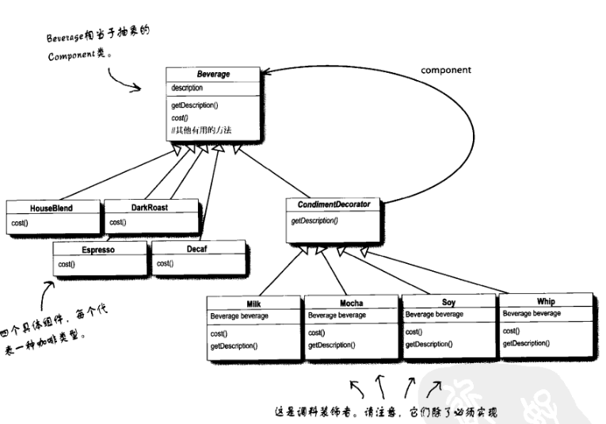
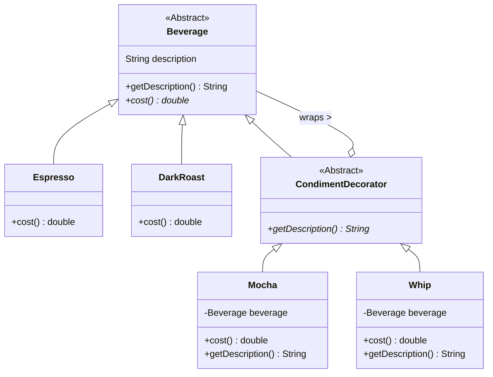
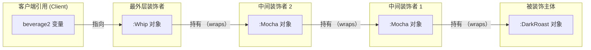
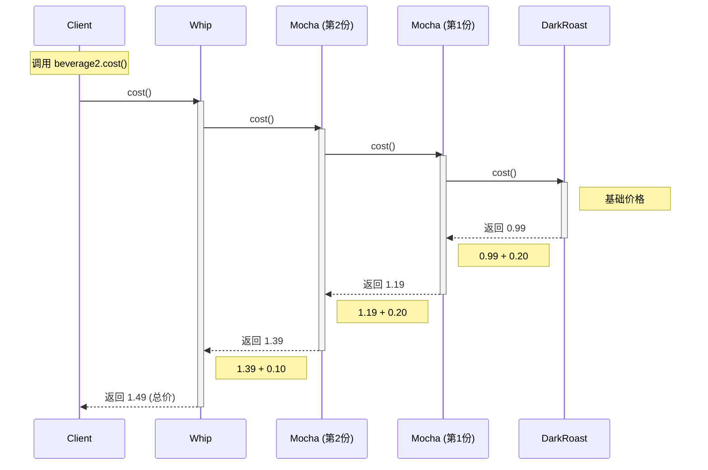

好的，根据课件内容，我们进入**结构型模式**的第一站：**装饰者模式 (Decorator Pattern)**。

这部分内容主要集中在您的课件 `9.Decorator_Adapter.pdf` 的前半部分（第1-6页，以及最后的Java IO部分）。

---

### 1. 场景：星巴克咖啡订单系统 (Starbuzz Coffee)

假设我们要为咖啡店设计一个订单系统。
*   **主体饮料 (Beverage)**：深焙 (DarkRoast)、浓缩 (Espresso)、低咖啡因 (Decaf) 等。
*   **调料 (Condiment)**：蒸奶 (Steamed Milk)、豆浆 (Soy)、摩卡 (Mocha/巧克力)、奶泡 (Whip)。

**遇到的问题：**
顾客点单时会要求各种组合，比如“双份摩卡豆浆浓缩咖啡”。
1.  **滥用继承**：如果为每一种组合都创建一个类（如 `EspressoWithMochaAndSoy`），会导致类爆炸，维护噩梦。
2.  **类中加标志位**：如果在 `Beverage` 基类中加入 `hasMilk`, `hasMocha` 等布尔变量。缺点是：如果调料价格上涨需要改基类；如果顾客想要“双份摩卡”，布尔值无法解决；如果有新调料（如焦糖），又要修改基类。

**核心设计原则：**
> **开闭原则 (Open-Closed Principle)**：类应该对扩展开放，对修改关闭。

### 2. 解决方案：像“俄罗斯套娃”一样包装对象

**装饰者模式**允许我们动态地将责任附加到对象上。我们不修改代码，而是通过**包装 (Wrapping)** 的方式来扩展功能。

*   我们拿一杯 `DarkRoast`（主体）。
*   想加摩卡？我们就用 `Mocha` 对象把它包起来。
*   想加奶泡？我们再用 `Whip` 对象把刚才的包起来。
*   算钱的时候？最外层的对象调用里面的 `cost()`，再加上自己的钱。

### 3. 代码实现

#### A. 抽象组件 (Component)

这是所有饮料和调料的共同父类。

```java
public abstract class Beverage {
    String description = "Unknown Beverage";
  
    public String getDescription() {
        return description;
    }
  
    // 计算价格的方法，必须由子类实现
    public abstract double cost();
}
```

#### B. 具体组件 (Concrete Component)

这是被装饰的“主体”，比如浓缩咖啡。

```java
public class Espresso extends Beverage {
    public Espresso() {
        description = "Espresso";
    }
  
    public double cost() {
        return 1.99; // 基础价格
    }
}
```

#### C. 抽象装饰者 (Decorator)

这是装饰者模式最关键的一步。
*   **继承**：它必须继承自 `Beverage`，**目的是为了“类型匹配”**（让装饰后的对象依然是一杯 Beverage，可以继续被装饰）。
*   **组合**：它虽然没写在下面的代码里（通常在具体子类或这里持有），但在逻辑上它内部持有一个 `Beverage` 对象。

```java
// 必须继承 Beverage，这样装饰者才能取代被装饰者
public abstract class CondimentDecorator extends Beverage {
    //以此强制所有装饰者重写此方法，以便合成描述
    public abstract String getDescription(); 
}
```

#### D. 具体装饰者 (Concrete Decorator)

比如摩卡（Mocha）。

```java
public class Mocha extends CondimentDecorator {
    // 1. 用一个实例变量记录被装饰的对象（组合）
    Beverage beverage;
 
    // 2. 构造函数传入被装饰的对象
    public Mocha(Beverage beverage) {
        this.beverage = beverage;
    }
 
    // 3. 加上自己的描述
    public String getDescription() {
        return beverage.getDescription() + ", Mocha";
    }
 
    // 4. 核心逻辑：调用被装饰者的cost() + 自己的价格
    public double cost() {
        return .20 + beverage.cost();
    }
}
```

### 4. 客户端如何使用（测试代码）

这对应课件第3页和第5页的代码演示。

```java
public class StarbuzzCoffee {
    public static void main(String args[]) {
        // 1. 点一杯单纯的浓缩
        Beverage beverage = new Espresso();
        System.out.println(beverage.getDescription() + " $" + beverage.cost());
 
        // 2. 点一杯 深焙 + 摩卡 + 摩卡 + 奶泡
        Beverage beverage2 = new DarkRoast();
        // 开始包装（装饰）
        beverage2 = new Mocha(beverage2); // 加第一份摩卡
        beverage2 = new Mocha(beverage2); // 加第二份摩卡
        beverage2 = new Whip(beverage2);  // 加奶泡
        
        // 调用最外层的 cost()，它会连锁调用进去
        System.out.println(beverage2.getDescription() + " $" + beverage2.cost());
    }
}
```

### 5. 课件中的重点图解（Slide 6）

课件用一个非常形象的**同心圆/洋葱圈**图展示了调用过程：
1.  最外层 `Whip.cost()` 被调用。
2.  它调用里面的 `Mocha.cost()`。
3.  `Mocha` 调用里面的 `DarkRoast.cost()`。
4.  `DarkRoast` 返回 $0.99。
5.  `Mocha` 加上自己的 $0.20，返回 $1.19。
6.  `Whip` 加上自己的 $0.10，最终返回 $1.29。

### 6. 现实世界的例子：Java I/O

课件在第33-35页提到了Java类库中最著名的装饰者模式应用：`java.io` 包。

你一定写过这样的代码：

```java
// FileInputStream 是组件（被装饰者）
// BufferedInputStream 是装饰者（添加缓冲功能）
// LineNumberInputStream 是装饰者（添加行号功能）

InputStream in = 
    new LineNumberInputStream(
        new BufferedInputStream(
            new FileInputStream("test.txt")
        )
    );
```

这与咖啡的例子一模一样：通过层层包装，给基本的字节流添加了缓冲和读取行号的功能。

### 总结

*   **定义**：动态地将责任附加到对象上。若要扩展功能，装饰者提供了比继承更有弹性的替代方案。
*   **优点**：比继承灵活，可以在运行时动态决定添加什么功能；符合开闭原则。
*   **缺点**：会产生很多小对象（各种装饰类），如果过度使用会让代码变得复杂难懂（比如 Java I/O 那长长的构造链）。


---

## 类图与流程图

**Head First 书中原图：**



### 1. 类图 (Class Diagram)
这张图展示了装饰者模式的核心结构：`CondimentDecorator` 既**继承**了 `Beverage`（为了保持类型一致），又**持有**了一个 `Beverage`（为了进行包装）。



---

### 2. 运行时对象结构图 (Object Graph)
这张图对应代码中的例子：`new Whip(new Mocha(new Mocha(new DarkRoast())))`。
它形象地展示了“洋葱圈”或者“俄罗斯套娃”的结构。



---

### 3. 价格计算时序图 (Sequence Diagram)
这张图展示了当调用最外层的 `.cost()` 时，系统是如何层层深入直到最内层，然后层层返回并累加价格的。


