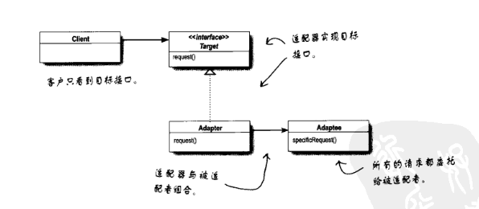
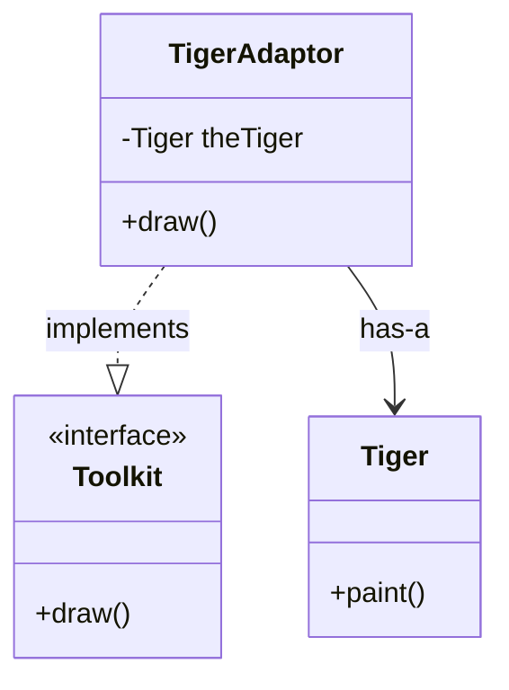
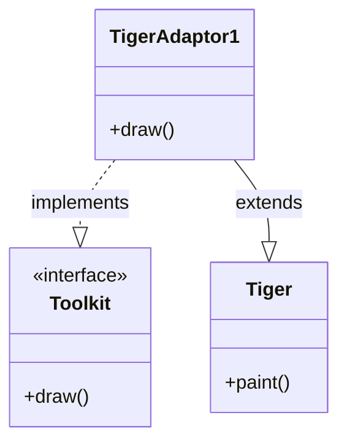
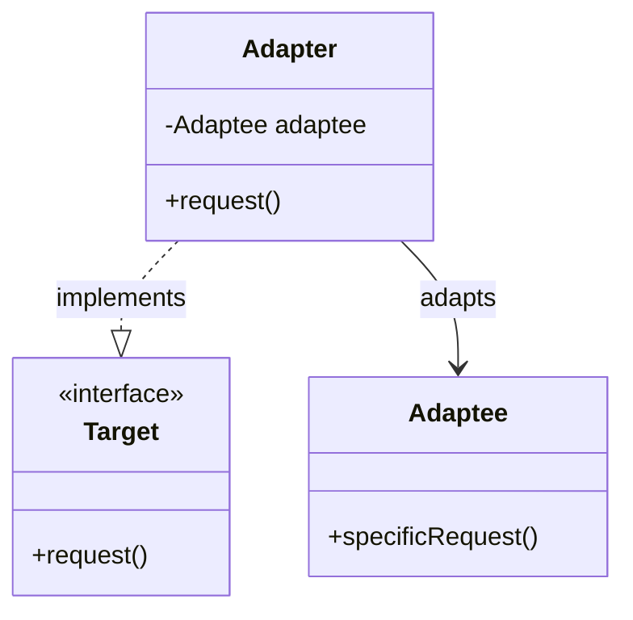

## 适配器模式 (Adapter Pattern)

适配器模式用于让不兼容的接口协同工作。

### 1. 场景：动物图形编辑器

假设我们正在开发一个图形编辑器，系统定义了一个统一的接口（`Toolkit` 或 `Shape`），所有的图形对象都必须实现一个 `draw()` 方法来显示自己。

- **现有代码**：`Dog`, `Cat`, `Fish` 都很好地遵循了这个标准，实现了 `draw()`。
- **新需求**：我们需要重用一个已经存在的第三方类库或遗留代码中的 `Tiger` 类。
- **问题**：`Tiger` 类并没有 `draw()` 方法，它只有一个功能类似的方法叫 `paint()`。而且我们**无法（或不应该）修改** `Tiger` 的源代码。

**核心冲突**：
> 客户端期望调用 `draw()`，但目标对象只有 `paint()`。接口不兼容。

### 2. 核心定义

> **适配器模式**：将一个类的接口转换成客户期望的另一个接口。适配器让原本接口不兼容的类可以合作无间。

课件中提供了两种实现策略：**对象适配器**和**类适配器**。

---

### 3. 策略一：对象适配器 (Object Adapter) —— 推荐

这是最常用的一种形式，它利用了**组合 (Composition)**。

- **原理**：适配器实现目标接口（`Toolkit`），并在内部持有被适配者（`Tiger`）的实例。当客户端调用 `draw()` 时，适配器转手调用 `Tiger` 的 `paint()`。

#### 代码实现

```java
// 1. 目标接口 (Target)
public interface Toolkit {
    void draw();
}

// 2. 被适配者 (Adaptee) - 既有的代码，我们无法修改它，或者不想修改它
public class Tiger {
    public void paint() {
        System.out.println("Tiger is painting...");
    }
}

// 3. 适配器 (Adapter)
public class TigerAdaptor implements Toolkit {
    // 关键：使用组合，持有一个 Tiger 对象的引用
    private Tiger theTiger;

    // 通过构造函数注入具体的 Tiger 实例
    public TigerAdaptor(Tiger t) {
        this.theTiger = t;
    }

    // 实现目标接口
    @Override
    public void draw() {
        // 关键：委托给 Tiger 的 paint 方法
        theTiger.paint(); 
    }
}
```

**客户端使用：**
```java
Tiger tiger = new Tiger();
Toolkit shape = new TigerAdaptor(tiger); // 客户端把它当做 Toolkit 使用
shape.draw(); // 实际上调用的是 tiger.paint()
```

#### 对象适配器类图



---

### 4. 策略二：类适配器 (Class Adapter)

这种形式利用了**继承 (Inheritance)**。

- **原理**：适配器同时继承被适配者（`Tiger`）和实现目标接口（`Toolkit`）。
- **限制**：需要语言支持多重继承（如 C++）。在 Java 中，通过"继承一个类 + 实现一个接口"来模拟。

#### 代码实现

```java
// 适配器直接继承 Tiger，同时实现 Toolkit
public class TigerAdaptor1 extends Tiger implements Toolkit {
    
    public TigerAdaptor1() {
        // 可能会调用父类构造函数
    }

    @Override
    public void draw() {
        // 直接调用父类（Tiger）的方法
        super.paint();
    }
}
```

#### 类适配器类图



---

### 5. 两种适配器的对比总结

| 特性 | 对象适配器 (Object Adapter) | 类适配器 (Class Adapter) |
| :--- | :--- | :--- |
| **实现方式** | **组合**：持有被适配者的引用。 | **继承**：继承被适配者。 |
| **灵活性** | **高**。可以适配某个类及其所有子类。 | **低**。只能适配一个特定的类。 |
| **耦合度** | **松耦合**。 | **紧耦合**。 |
| **Java支持** | 完全支持。 | 支持（通过 `extends Class implements Interface`），但如果 Target 也是类而非接口，Java 无法实现（不支持多继承）。 |

**设计原则回顾**：
这里再次印证了那个黄金法则：**多用组合，少用继承**。因此，在绝大多数情况下，我们**优先使用对象适配器**。

### 6. 现实生活中的例子

- **电源适配器**：把三孔插座（Adaptee）转换成你的两孔充电头能用的接口（Target）。
- **Java InputStreamReader**：把 `InputStream`（字节流）适配成 `Reader`（字符流）。

---

### 7. 通用类图（模式角色）


