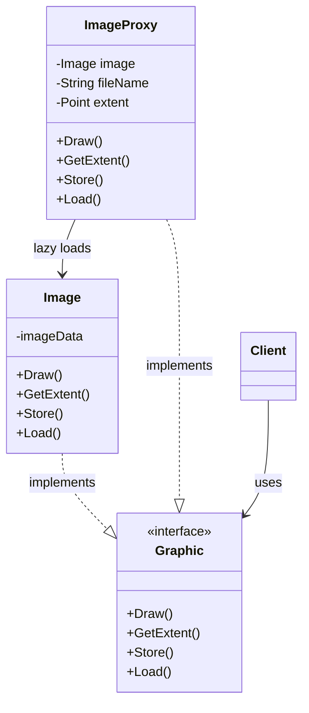

## 代理模式 (Proxy Pattern)

### 1. 场景：文档编辑器 (Document Editor)

试想我们在打开一个包含大量高分辨率图片的 Word 文档。

- **问题**：如果一打开文档就把所有图片都从硬盘读取并加载到内存中，打开速度会非常慢，且消耗巨大内存。
- **需求**：我们希望文档能"秒开"。图片只有在用户滚动到那一页，确实需要显示的时候，才去真正加载。

### 2. 解决方案：使用代理 (Proxy)

我们需要一个**替身**或**占位符**来代替真正的图片对象。这个替身很轻量，创建很快。

- **ImageProxy (代理)**：存在于内存中，负责占位。
- **Image (真实对象)**：存在于硬盘上，加载昂贵。

### 3. 核心定义

> **代理模式**：为另一个对象提供一个替身或占位符以**控制对这个对象的访问**。

### 4. 结构与代码逻辑

#### A. 共同接口 (Subject/Graphic)

无论是代理还是真实图片，对客户（编辑器）来说都是"图形"，可以绘制，可以获取尺寸。

```java
// 对应课件中的 Graphic 抽象类或接口
public interface Graphic {
    void Draw();
    void GetExtent(); // 获取尺寸
    void Store();
    void Load();
}
```

#### B. 真实对象 (RealSubject)

这是真正干重活的类，负责加载图片数据。

```java
public class Image implements Graphic {
    // ... 内部包含大量的图像数据 ...

    public void Draw() {
        // 在屏幕上绘制真正的图像
    }
    // ... 其他方法实现
}
```

#### C. 代理对象 (Proxy)

持有一个对真实对象的引用（初始为空）。

```java
public class ImageProxy implements Graphic {
    // 组合：持有真实对象的引用
    private Image image; 
    private String fileName;
    private Point extent; // 缓存图片的尺寸，这样获取尺寸时不用加载大图

    public ImageProxy(String fileName) {
        this.fileName = fileName;
        this.image = null; // 初始时不加载
    }

    // 核心逻辑：虚拟代理 (Virtual Proxy) 的体现
    public void Draw() {
        // 1. 如果真实对象还没创建，现在才创建（懒加载）
        if (image == null) {
            image = LoadImage(fileName); // 假设这是一个加载图片的方法
        }
        // 2. 委托给真实对象去画图
        image.Draw();
    }

    public void GetExtent() {
        // 优化：如果只是为了获取尺寸，可能不需要加载整张图
        if (image == null) {
            return extent; // 返回缓存的尺寸
        } else {
            return image.GetExtent();
        }
    }
    // ...
}
```

#### D. 客户端使用

```java
public class TextDocument {
    public static void main(String[] args) {
        // 创建代理对象，此时并未加载真正的图片
        Graphic image1 = new ImageProxy("photo1.jpg");
        Graphic image2 = new ImageProxy("photo2.jpg");
        
        // 文档秒开，因为只创建了轻量的代理对象
        System.out.println("文档已打开");
        
        // 用户滚动到第一张图片位置，此时才真正加载
        image1.Draw(); // 触发懒加载，加载 photo1.jpg 并绘制
        
        // 获取尺寸不需要加载整张图（如果有缓存）
        image2.GetExtent();
    }
}
```

### 5. 类图



### 6. 对象图解

- **在内存中**：`aTextDocument` 指向 `anImageProxy` (只存了文件名)。
- **在硬盘上**：`anImage` (存了实际数据)。
- 虚线箭头表示：只有需要时，Proxy 才会把硬盘上的 Image 加载进内存。

### 7. 代理模式的常见变体

| 类型 | 说明 | 示例 |
| :--- | :--- | :--- |
| **虚拟代理 (Virtual Proxy)** | 按需加载开销很大的对象 | 图片懒加载 |
| **远程代理 (Remote Proxy)** | 代表在不同地址空间（如远程服务器）的对象 | Java RMI |
| **保护代理 (Protection Proxy)** | 控制对原始对象的访问权限 | 权限检查 |

### 8. 核心考点

- **"控制访问"**：代理控制客户端对真实对象的访问
- **"延迟加载"**：虚拟代理实现懒加载，优化性能
