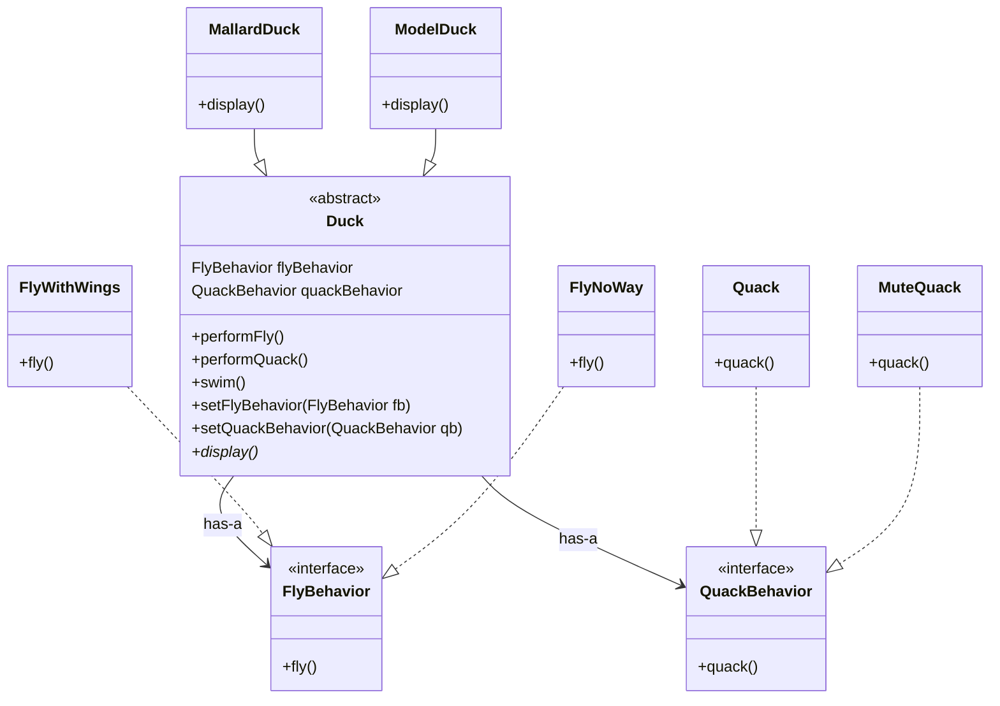

# 策略模式 (Strategy Pattern)

## 概述

这是《Head First 设计模式》的开篇模式，体现"多用组合，少用继承"原则的经典案例。

## 1. 场景：SimUDuck（鸭子模拟游戏）

假设我们在开发一款游戏，里面有各种鸭子：野鸭 (MallardDuck)、红头鸭 (RedheadDuck) 等。

- **初始设计**：有一个父类 `Duck`，里面有 `quack()`（叫）和 `swim()`（游泳）方法，还有一个抽象的 `display()` 方法由子类实现。
- **新需求**：我们要让鸭子**飞**起来。

**遇到的问题（继承的陷阱）：**

1. **简单的继承**：在 `Duck` 父类里加 `fly()` 方法。
   - **后果**：所有子类都继承，导致**橡皮鸭 (RubberDuck)** 也在飞。

2. **覆盖 (Override)**：在橡皮鸭里重写 `fly()` 让它什么都不做。
   - **后果**：如果有**诱饵鸭 (DecoyDuck)**（不会飞也不会叫），又要重写多个方法。48种鸭子修改起来是噩梦。

3. **接口 (Interface)**：把 `Flyable` 和 `Quackable` 定义成接口。
   - **后果**：解决了乱飞问题，但**完全丢失了代码复用**。每个会飞的鸭子都要写一遍飞行代码。

## 2. 核心设计原则

1. **封装变化**：找出可能需要变化之处，把它们独立出来。
2. **针对接口编程，而不是针对实现编程**。
3. **多用组合，少用继承**。

## 3. 解决方案：策略模式

将"飞行"和"叫声"这两种**行为**从 `Duck` 类中剥离出来，做成两组专门的**类**（算法族）。

## 4. 代码实现

### A. 定义策略接口

```java
public interface FlyBehavior {
    void fly();
}

public interface QuackBehavior {
    void quack();
}
```

### B. 实现具体策略

**飞行族：**

```java
// 用翅膀飞
public class FlyWithWings implements FlyBehavior {
    public void fly() {
        System.out.println("I'm flying!!");
    }
}

// 不会飞（给橡皮鸭用）
public class FlyNoWay implements FlyBehavior {
    public void fly() {
        System.out.println("I can't fly");
    }
}

// 火箭动力飞（给模型鸭用）
public class FlyRocketPowered implements FlyBehavior {
    public void fly() {
        System.out.println("I'm flying with a rocket!");
    }
}
```

**叫声族：**

```java
// 真的嘎嘎叫
public class Quack implements QuackBehavior {
    public void quack() {
        System.out.println("Quack");
    }
}

// 吱吱叫（橡皮鸭）
public class Squeak implements QuackBehavior {
    public void quack() {
        System.out.println("Squeak");
    }
}

// 不出声（诱饵鸭）
public class MuteQuack implements QuackBehavior {
    public void quack() {
        System.out.println("<< Silence >>");
    }
}
```

### C. 改造上下文 (Context) —— Duck 类

`Duck` 类不再亲自实现飞行和叫声，而是**持有**这两个接口的引用（组合），并将动作**委托**给它们执行。

```java
public abstract class Duck {
    // 关键点：声明为接口类型，而不是具体实现类
    FlyBehavior flyBehavior;
    QuackBehavior quackBehavior;

    public Duck() { }

    public abstract void display();

    // 委托给行为类处理
    public void performFly() {
        flyBehavior.fly();
    }

    public void performQuack() {
        quackBehavior.quack();
    }

    public void swim() {
        System.out.println("All ducks float, even decoys!");
    }
    
    // 关键点：动态改变行为
    // 允许在运行时改变鸭子的行为，这是继承做不到的
    public void setFlyBehavior(FlyBehavior fb) {
        flyBehavior = fb;
    }

    public void setQuackBehavior(QuackBehavior qb) {
        quackBehavior = qb;
    }
}
```

### D. 具体鸭子类

```java
// 野鸭 (MallardDuck)
public class MallardDuck extends Duck {
    public MallardDuck() {
        // 在构造函数中指定默认行为
        quackBehavior = new Quack();
        flyBehavior = new FlyWithWings();
    }

    public void display() {
        System.out.println("I'm a real Mallard duck");
    }
}

// 模型鸭 (ModelDuck)
public class ModelDuck extends Duck {
    public ModelDuck() {
        flyBehavior = new FlyNoWay(); // 一开始不会飞
        quackBehavior = new Quack();
    }

    public void display() {
        System.out.println("I'm a model duck");
    }
}
```

### E. 客户端测试：动态改变行为

这是策略模式最强大的地方：**运行时改变行为**。

```java
public class MiniDuckSimulator {
    public static void main(String[] args) {
        // 1. 测试野鸭
        Duck mallard = new MallardDuck();
        mallard.performQuack(); // 输出: Quack
        mallard.performFly();   // 输出: I'm flying!!

        // 2. 测试模型鸭（动态改变能力）
        Duck model = new ModelDuck();
        model.performFly();     // 输出: I can't fly
        
        // 突然，给模型鸭装上了火箭动力！
        model.setFlyBehavior(new FlyRocketPowered());
        model.performFly();     // 输出: I'm flying with a rocket!
    }
}
```

## 5. 类图



## 6. 总结

- **定义**：策略模式定义了**算法族**，分别**封装**起来，让他们之间可以**互相替换**，此模式让算法的变化独立于使用算法的客户。

- **优点**：
  - 利用组合（Has-A）代替继承（Is-A），代码更有弹性
  - 可以在运行时动态改变对象的行为
  - 避免了多重条件判断语句（if-else）

## 7. 策略模式 vs 状态模式

| 模式 | 意图 | 谁决定切换 |
| :--- | :--- | :--- |
| **策略模式** | 替换算法，客户端主动指定 | **客户端**（装火箭） |
| **状态模式** | 根据状态改变行为，自动切换 | **Context 或 State 内部**（TCP 自动变化） |
