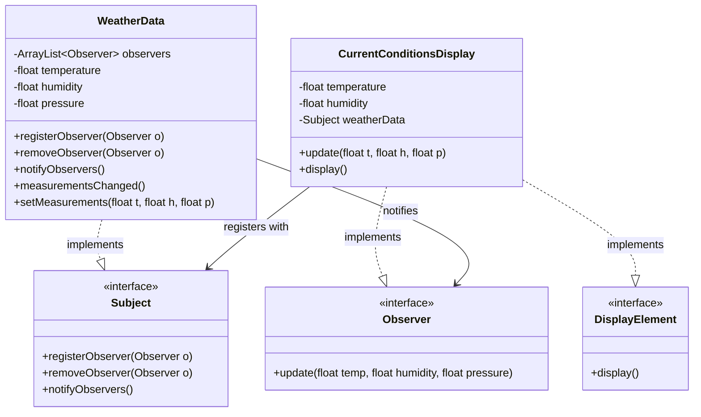

## 观察者模式 (Observer Pattern)

### 1. 场景：Weather-O-Rama 气象站

假设我们要为"Weather-O-Rama"公司开发气象站系统。

- **WeatherData 对象**：负责从物理传感器获取数据（温度、湿度、气压）。
- **布告板 (Display Elements)**：有三个布告板，分别显示"当前状况"、"气象统计"和"天气预报"。
- **需求**：一旦 `WeatherData` 获取到最新的测量数据，这三个布告板必须**实时更新**。而且未来可能会有第三方开发者加入新的布告板。

**错误的实现：**

```java
public class WeatherData {
    public void measurementsChanged() {
        float temp = getTemperature();
        float humidity = getHumidity();
        float pressure = getPressure();

        // 错误：针对实现编程，而非针对接口
        // 如果以后要增加第4个布告板，就必须修改这行代码
        currentConditionsDisplay.update(temp, humidity, pressure);
        statisticsDisplay.update(temp, humidity, pressure);
        forecastDisplay.update(temp, humidity, pressure);
    }
}
```

这种写法违反了**开闭原则**，也导致了`WeatherData`与具体的布告板**紧耦合**。

### 2. 核心定义

> **观察者模式**：定义了对象之间的一对多依赖，这样一来，当一个对象改变状态时，它的所有依赖者都会收到通知并自动更新。

- **主题 (Subject)**：即"出版者"，拥有数据的人（`WeatherData`）。
- **观察者 (Observer)**：即"订阅者"，需要数据的人（各种布告板）。

### 3. 代码实现

#### A. 定义接口

```java
// 主题接口：管理观察者的注册和移除，以及通知功能
public interface Subject {
    void registerObserver(Observer o);
    void removeObserver(Observer o);
    void notifyObservers();
}

// 观察者接口：所有布告板都必须实现这个接口，以便接收更新
public interface Observer {
    // 这里采用的是"推(Push)"模式，主题把数据直接推给观察者
    void update(float temp, float humidity, float pressure);
}

// 显示接口（可选，为了代码整洁）
public interface DisplayElement {
    void display();
}
```

#### B. 实现主题 (Concrete Subject)

```java
import java.util.ArrayList;

public class WeatherData implements Subject {
    // 关键点：用一个列表记录所有的观察者
    private ArrayList<Observer> observers;
    private float temperature;
    private float humidity;
    private float pressure;

    public WeatherData() {
        observers = new ArrayList<Observer>();
    }

    // 注册观察者
    public void registerObserver(Observer o) {
        observers.add(o);
    }

    // 移除观察者
    public void removeObserver(Observer o) {
        int i = observers.indexOf(o);
        if (i >= 0) {
            observers.remove(i);
        }
    }

    // 通知所有观察者
    public void notifyObservers() {
        for (Observer observer : observers) {
            // 遍历列表，逐个调用 update
            observer.update(temperature, humidity, pressure);
        }
    }

    // 当从传感器获取到新数据时调用此方法
    public void measurementsChanged() {
        notifyObservers();
    }

    // 模拟设置测量数据（用于测试）
    public void setMeasurements(float temperature, float humidity, float pressure) {
        this.temperature = temperature;
        this.humidity = humidity;
        this.pressure = pressure;
        measurementsChanged();
    }
}
```

#### C. 实现观察者 (Concrete Observer)

以"当前状况布告板"为例：

```java
public class CurrentConditionsDisplay implements Observer, DisplayElement {
    private float temperature;
    private float humidity;
    private Subject weatherData; // 持有主题的引用，方便以后取消注册

    public CurrentConditionsDisplay(Subject weatherData) {
        this.weatherData = weatherData;
        // 构造时把自己注册给主题
        weatherData.registerObserver(this);
    }

    // 实现接口方法，接收数据更新
    public void update(float temperature, float humidity, float pressure) {
        this.temperature = temperature;
        this.humidity = humidity;
        display();
    }

    public void display() {
        System.out.println("Current conditions: " + temperature 
                           + "F degrees and " + humidity + "% humidity");
    }
}
```

#### D. 客户端测试

```java
public class WeatherStation {
    public static void main(String[] args) {
        // 1. 创建主题
        WeatherData weatherData = new WeatherData();

        // 2. 创建布告板（观察者），并自动注册到主题中
        CurrentConditionsDisplay currentDisplay = 
            new CurrentConditionsDisplay(weatherData);
        // 假设还有其他布告板...
        // StatisticsDisplay statisticsDisplay = new StatisticsDisplay(weatherData);

        // 3. 模拟气象数据变化
        // 主题会根据新数据自动通知所有布告板更新
        weatherData.setMeasurements(80, 65, 30.4f);
        weatherData.setMeasurements(82, 70, 29.2f);
    }
}
```

### 4. 类图



### 5. 核心设计原则

> **为了交互对象之间的松耦合设计而努力 (Strive for loosely coupled design between objects that interact)。**

- **松耦合**：`WeatherData` 只知道观察者实现了 `Observer` 接口，不需要知道观察者具体是谁、做了什么。这使得我们可以随时增加新的布告板，而不需要修改 `WeatherData` 的代码。

### 6. 推(Push) vs 拉(Pull)

| 模式 | 说明 | 优缺点 |
| :--- | :--- | :--- |
| **推 (Push)** | 主题主动发送具体数据，`update(temp, humidity, pressure)` | 观察者可以直接用；但可能收到不需要的数据 |
| **拉 (Pull)** | 主题只通知"数据更新了"，`update()` 无参数，观察者自己调用 `getTemperature()` 等方法获取 | 更灵活，观察者按需获取 |
