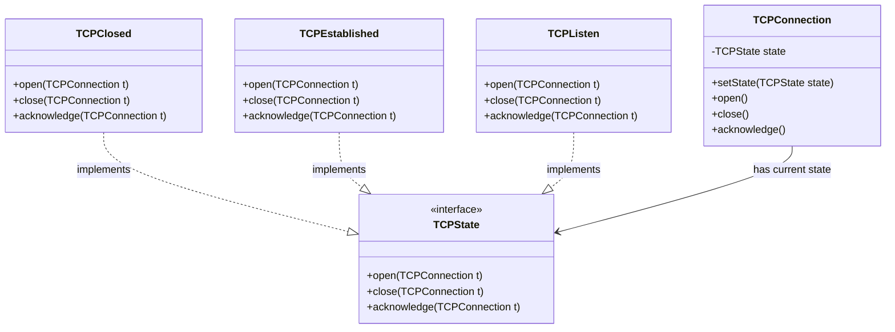

## 状态模式 (State Pattern)

### 1. 场景：TCP 连接 (TCP Connection)

我们在设计一个网络连接类 `TCPConnection`。

- **对象的状态**：一个连接在不同时刻可能处于不同的状态：
  1. **连接已建立 (Established)**
  2. **正在监听 (Listening)**
  3. **连接已关闭 (Closed)**

- **行为的变化**：当其他对象对这个连接发出请求（如 `Open()`、`Close()` 或 `Acknowledge()`）时，`TCPConnection` 的反应完全取决于**它当前处于哪个状态**。

**错误的实现：**

```java
public void open() {
    if (state == CLOSED) {
        // 去建立连接...
        state = ESTABLISHED;
    } else if (state == ESTABLISHED) {
        // 啥也不做...
    } else if (state == LISTENING) {
        // ...
    }
}
```

这种代码非常难以维护，尤其是当状态增多时（TCP 协议实际上有十几种状态）。

### 2. 核心定义

> **状态模式**：允许对象在内部状态改变时改变它的行为，对象看起来好像修改了它的类。

### 3. 结构与代码实现

#### A. 状态接口 (State)

```java
// 对应课件中的 TCPState 抽象类
public interface TCPState {
    // 传入 context (TCPConnection) 是为了让状态能回调 context 来切换状态
    void open(TCPConnection t);
    void close(TCPConnection t);
    void acknowledge(TCPConnection t);
}
```

#### B. 具体状态 (Concrete States)

```java
// 1. 连接已关闭状态
public class TCPClosed implements TCPState {
    public void open(TCPConnection t) {
        System.out.println("正在打开连接...");
        // 关键点：状态转换
        t.setState(new TCPEstablished()); 
    }

    public void close(TCPConnection t) {
        System.out.println("已经是关闭状态了");
    }

    public void acknowledge(TCPConnection t) {
        System.out.println("错误：未连接，无法回应");
    }
}

// 2. 连接已建立状态
public class TCPEstablished implements TCPState {
    public void open(TCPConnection t) {
        System.out.println("已经是连接状态了");
    }

    public void close(TCPConnection t) {
        System.out.println("正在关闭连接...");
        t.setState(new TCPClosed());
    }

    public void acknowledge(TCPConnection t) {
        System.out.println("发送 ACK 回应");
    }
}

// 3. 监听状态 (TCPListen) 代码类似，略...
```

#### C. 上下文 (Context)

```java
public class TCPConnection {
    // 持有当前状态的引用
    private TCPState state;

    public TCPConnection() {
        // 初始状态可能是 Closed
        this.state = new TCPClosed();
    }

    // 提供给状态类用来切换状态的方法
    public void setState(TCPState state) {
        this.state = state;
    }

    // --- 下面是客户端调用的方法，全部委托给 state 处理 ---

    public void open() {
        state.open(this); // 委托 (Delegation)
    }

    public void close() {
        state.close(this);
    }

    public void acknowledge() {
        state.acknowledge(this);
    }
}
```

#### D. 客户端使用

```java
public class Client {
    public static void main(String[] args) {
        TCPConnection connection = new TCPConnection();
        
        // 初始是 Closed，调用 open 会切换到 Established
        connection.open(); 
        
        // 现在是 Established，调用 acknowledge 会正常工作
        connection.acknowledge(); 
        
        // 调用 close，切换回 Closed
        connection.close(); 
        
        // 现在是 Closed，调用 acknowledge 会报错
        connection.acknowledge(); 
    }
}
```

### 4. 类图



### 5. 总结

- **核心思想**：将与特定状态相关的行为局部化，并且将不同状态的行为分割开来。
- **优点**：
  - 消除了庞大的条件分支语句
  - 让状态转换显式化（通过 `setState`）

### 6. 状态模式 vs 策略模式

虽然类图看起来几乎一样（都是 Context 持有一个接口），但**意图**不同：

| 模式 | 意图 | 谁决定切换 |
| :--- | :--- | :--- |
| **策略模式** | 替换算法，一旦选定通常不变 | **客户端**指定具体策略 |
| **状态模式** | 根据状态改变行为，运行时自动切换 | **状态对象自己**知道下一个状态 |
