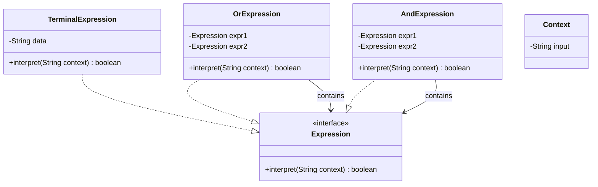

# 解释器模式 (Interpreter Pattern)

## 概述

这个模式通常用于处理**语言的语法分析**。在日常业务开发中用得不多，但在特定领域（编译器、正则表达式引擎、SQL解析、规则引擎）非常重要。

## 1. 场景与定义

- **场景**：假设你需要开发一个程序来处理正则表达式（如 `raining & (dogs | cats) *`），或者设计一个简单的布尔逻辑查询语言。
- **核心定义**：给定一个语言，定义它的文法的一种表示，并定义一个解释器，这个解释器使用该表示来解释语言中的句子。

## 2. 核心结构：组合模式的变体

类图非常像**组合模式 (Composite Pattern)**。因为"语法树"（Abstract Syntax Tree, AST）本质上就是一个递归的树形结构。

- **AbstractExpression (抽象表达式)**：声明一个 `interpret()` 操作。
- **TerminalExpression (终结符表达式)**：代表文法中的叶子节点（例如具体的单词、常量）。不再包含其他表达式。
- **NonterminalExpression (非终结符表达式)**：代表文法中的规则（例如 AND, OR, 循环）。通常包含（聚合）其他的 `AbstractExpression`。
- **Context (上下文)**：包含解释器之外的一些全局信息（例如输入字符串、变量的值）。

## 3. 代码实现

实现一个简单的**布尔逻辑解释器**，解释类似 `"London" AND "Raining"` 这样的规则。

### A. 抽象表达式接口

```java
public interface Expression {
    // interpret 方法接收上下文（这里 Context 就是我们要判断的文本内容）
    boolean interpret(String context);
}
```

### B. 终结符表达式 (Terminal Expression)

最基础的单元，用来判断文本中是否包含某个具体的单词。

```java
public class TerminalExpression implements Expression {
    private String data;

    public TerminalExpression(String data) {
        this.data = data;
    }

    @Override
    public boolean interpret(String context) {
        // 简单的逻辑：判断上下文中是否包含这个单词
        return context.contains(data);
    }
}
```

### C. 非终结符表达式 (Non-terminal Expression)

实现 `OrExpression` 和 `AndExpression`，它们内部持有其他的表达式。

```java
// 或运算 (OR)
public class OrExpression implements Expression {
    private Expression expr1;
    private Expression expr2;

    public OrExpression(Expression expr1, Expression expr2) {
        this.expr1 = expr1;
        this.expr2 = expr2;
    }

    @Override
    public boolean interpret(String context) {
        // 只要有一个为真，结果就为真
        return expr1.interpret(context) || expr2.interpret(context);
    }
}

// 与运算 (AND)
public class AndExpression implements Expression {
    private Expression expr1;
    private Expression expr2;

    public AndExpression(Expression expr1, Expression expr2) {
        this.expr1 = expr1;
        this.expr2 = expr2;
    }

    @Override
    public boolean interpret(String context) {
        // 两个都必须为真
        return expr1.interpret(context) && expr2.interpret(context);
    }
}
```

### D. 客户端测试

构建语法树并进行解释。

```java
public class InterpreterPatternDemo {

    // 规则1：是 "Robert" 或者 "John"
    public static Expression getMaleExpression() {
        Expression robert = new TerminalExpression("Robert");
        Expression john = new TerminalExpression("John");
        return new OrExpression(robert, john);
    }

    // 规则2：必须同时包含 "Julie" 和 "Married"
    public static Expression getMarriedWomanExpression() {
        Expression julie = new TerminalExpression("Julie");
        Expression married = new TerminalExpression("Married");
        return new AndExpression(julie, married);
    }

    public static void main(String[] args) {
        // 构建语法树
        Expression isMale = getMaleExpression();
        Expression isMarriedWoman = getMarriedWomanExpression();

        // 测试解释器
        System.out.println("John is male? " + isMale.interpret("John")); // true
        System.out.println("Julie is a married women? " 
                           + isMarriedWoman.interpret("Married Julie")); // true
        System.out.println("Lucy is male? " + isMale.interpret("Lucy")); // false
    }
}
```

## 4. 类图



## 5. 总结

- **适用场景**：当有一个语言需要解释执行，并且你可以将该语言中的句子表示为一个抽象语法树时。例如：SQL 解析、计算器表达式（1+2*3）、正则表达式。

- **优点**：易于改变和扩展文法。如果想增加一个新的规则（比如 `NotExpression`），只需增加一个新的类，无需修改现有代码。

- **缺点**：**类膨胀**。对于复杂的文法，文法的每一条规则都需要一个类，这会导致类变得非常多，且语法树很大时效率较低。

重点在于理解它**如何利用对象组合来表示语法规则**。
