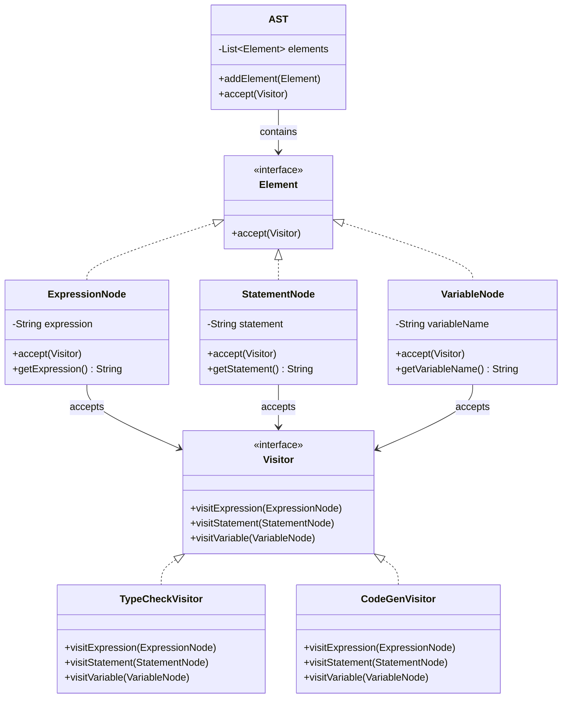
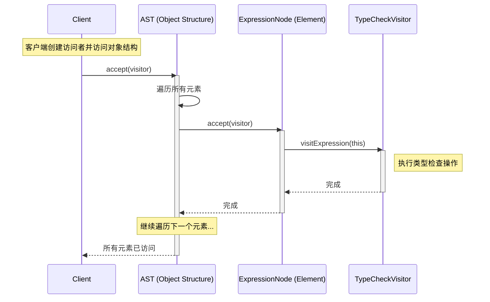

## 访问者模式 (Visitor Pattern)

访问者模式是一种行为型设计模式，它允许你在不改变对象结构的前提下，定义作用于这些对象的新操作。

### 1. 场景：编译器语法树操作

假设我们正在构建一个编译器，需要处理不同类型的语法节点（如表达式、语句等）。

**问题：**
- 我们需要对语法树进行多种操作：类型检查、代码生成、代码优化、格式化输出等
- 如果每种操作都作为方法添加到每个节点类中，会导致：
  1. **违反开闭原则**：每增加一种新操作，都要修改所有节点类
  2. **职责混乱**：节点类既要表示语法结构，又要处理各种操作
  3. **难以维护**：操作代码分散在各个节点类中

**解决方案：访问者模式**
- 将操作从节点类中分离出来，封装到**访问者 (Visitor)** 中
- 节点类只负责接受访问者，让访问者来处理操作

### 2. 核心定义

> **访问者模式**：表示一个作用于某对象结构中的各元素的操作。它使你可以在不改变各元素的类的前提下定义作用于这些元素的新操作。

### 3. 代码实现

#### A. 抽象元素 (Element)

定义接受访问者的接口。

```java
// 抽象元素接口：所有节点都必须实现 accept 方法
public interface Element {
    // 关键：接受访问者，让访问者来执行操作
    void accept(Visitor visitor);
}
```

#### B. 具体元素 (Concrete Element)

实现具体的节点类。

```java
// 表达式节点
public class ExpressionNode implements Element {
    private String expression;

    public ExpressionNode(String expression) {
        this.expression = expression;
    }

    public String getExpression() {
        return expression;
    }

    // 关键：接受访问者，调用访问者对应的方法
    @Override
    public void accept(Visitor visitor) {
        visitor.visitExpression(this);
    }
}

// 语句节点
public class StatementNode implements Element {
    private String statement;

    public StatementNode(String statement) {
        this.statement = statement;
    }

    public String getStatement() {
        return statement;
    }

    @Override
    public void accept(Visitor visitor) {
        visitor.visitStatement(this);
    }
}

// 变量节点
public class VariableNode implements Element {
    private String variableName;

    public VariableNode(String variableName) {
        this.variableName = variableName;
    }

    public String getVariableName() {
        return variableName;
    }

    @Override
    public void accept(Visitor visitor) {
        visitor.visitVariable(this);
    }
}
```

#### C. 抽象访问者 (Visitor)

定义访问各种元素的方法。

```java
// 抽象访问者：为每种元素类型定义一个访问方法
public interface Visitor {
    // 访问表达式节点
    void visitExpression(ExpressionNode node);
    
    // 访问语句节点
    void visitStatement(StatementNode node);
    
    // 访问变量节点
    void visitVariable(VariableNode node);
}
```

#### D. 具体访问者 (Concrete Visitor)

实现具体的操作。

```java
// 类型检查访问者
public class TypeCheckVisitor implements Visitor {
    @Override
    public void visitExpression(ExpressionNode node) {
        System.out.println("类型检查: 表达式 " + node.getExpression());
        // 执行类型检查逻辑
    }

    @Override
    public void visitStatement(StatementNode node) {
        System.out.println("类型检查: 语句 " + node.getStatement());
        // 执行类型检查逻辑
    }

    @Override
    public void visitVariable(VariableNode node) {
        System.out.println("类型检查: 变量 " + node.getVariableName());
        // 执行类型检查逻辑
    }
}

// 代码生成访问者
public class CodeGenVisitor implements Visitor {
    @Override
    public void visitExpression(ExpressionNode node) {
        System.out.println("生成代码: 表达式 " + node.getExpression());
        // 生成表达式对应的代码
    }

    @Override
    public void visitStatement(StatementNode node) {
        System.out.println("生成代码: 语句 " + node.getStatement());
        // 生成语句对应的代码
    }

    @Override
    public void visitVariable(VariableNode node) {
        System.out.println("生成代码: 变量 " + node.getVariableName());
        // 生成变量对应的代码
    }
}

// 格式化输出访问者
public class FormatVisitor implements Visitor {
    @Override
    public void visitExpression(ExpressionNode node) {
        System.out.println("格式化: " + node.getExpression());
    }

    @Override
    public void visitStatement(StatementNode node) {
        System.out.println("格式化: " + node.getStatement());
    }

    @Override
    public void visitVariable(VariableNode node) {
        System.out.println("格式化: " + node.getVariableName());
    }
}
```

#### E. 对象结构 (Object Structure)

维护元素集合，提供遍历接口。

```java
import java.util.ArrayList;
import java.util.List;

// 对象结构：维护元素集合
public class AST {
    private List<Element> elements;

    public AST() {
        elements = new ArrayList<>();
    }

    public void addElement(Element element) {
        elements.add(element);
    }

    // 关键：接受访问者，遍历所有元素并让访问者访问
    public void accept(Visitor visitor) {
        for (Element element : elements) {
            element.accept(visitor);
        }
    }
}
```

#### F. 客户端使用

```java
public class Compiler {
    public static void main(String[] args) {
        // 1. 构建语法树
        AST ast = new AST();
        ast.addElement(new ExpressionNode("x + y"));
        ast.addElement(new StatementNode("if (x > 0)"));
        ast.addElement(new VariableNode("x"));
        ast.addElement(new VariableNode("y"));

        // 2. 执行类型检查
        System.out.println("=== 类型检查 ===");
        TypeCheckVisitor typeChecker = new TypeCheckVisitor();
        ast.accept(typeChecker);

        // 3. 生成代码
        System.out.println("\n=== 代码生成 ===");
        CodeGenVisitor codeGen = new CodeGenVisitor();
        ast.accept(codeGen);

        // 4. 格式化输出
        System.out.println("\n=== 格式化输出 ===");
        FormatVisitor formatter = new FormatVisitor();
        ast.accept(formatter);
    }
}
```

**输出结果：**
```
=== 类型检查 ===
类型检查: 表达式 x + y
类型检查: 语句 if (x > 0)
类型检查: 变量 x
类型检查: 变量 y

=== 代码生成 ===
生成代码: 表达式 x + y
生成代码: 语句 if (x > 0)
生成代码: 变量 x
生成代码: 变量 y

=== 格式化输出 ===
格式化: x + y
格式化: if (x > 0)
格式化: x
格式化: y
```

### 4. 类图



### 5. 时序图



### 6. 双重分发 (Double Dispatch)

访问者模式的核心是**双重分发**机制：

1. **第一次分发**：客户端调用 `element.accept(visitor)`
   - 根据元素的类型（ExpressionNode、StatementNode 等）选择调用哪个 `accept` 方法

2. **第二次分发**：`accept` 方法内部调用 `visitor.visitXxx(this)`
   - 根据访问者的类型（TypeCheckVisitor、CodeGenVisitor 等）选择调用哪个 `visit` 方法

**双重分发的优势：**
- 不需要使用 `instanceof` 或类型判断
- 操作和元素类型在编译时确定，类型安全
- 符合开闭原则：添加新操作只需添加新的访问者类

### 7. 优缺点

#### 优点

1. **符合开闭原则**：
   - 添加新操作：只需创建新的访问者类，不需要修改元素类
   - 添加新元素：需要修改所有访问者接口（这是访问者模式的限制）

2. **职责分离**：
   - 元素类只负责数据结构
   - 访问者类负责操作逻辑

3. **集中管理操作**：
   - 相关操作集中在同一个访问者类中，便于维护

4. **易于扩展新操作**：
   - 添加新操作只需添加新的访问者实现

#### 缺点

1. **难以添加新元素类型**：
   - 添加新元素需要修改所有访问者接口，违反开闭原则

2. **破坏封装**：
   - 访问者需要访问元素的内部状态，可能需要将私有成员改为公有

3. **元素类型必须稳定**：
   - 如果元素类型经常变化，访问者模式不适用

### 8. 适用场景

1. **对象结构稳定，操作经常变化**：
   - 如编译器：语法树结构稳定，但需要不断添加新的分析操作

2. **需要对对象结构进行多种不相关的操作**：
   - 如文档处理：需要格式化、打印、导出等多种操作

3. **操作需要访问对象的内部状态**：
   - 访问者可以集中访问和操作对象状态

4. **避免污染元素类**：
   - 不想在元素类中添加太多操作方法

### 9. 与其他模式的关系

- **组合模式**：访问者模式常用于遍历组合结构
- **解释器模式**：访问者模式常用于对抽象语法树进行操作
- **策略模式**：访问者可以看作是一种策略，但访问者模式更关注操作与结构的分离

### 10. 实际应用示例

#### Java 中的访问者模式

Java 的 `javax.lang.model` 包中使用了访问者模式来处理注解：

```java
// Element 接口
public interface Element {
    <R, P> R accept(ElementVisitor<R, P> v, P p);
}

// ElementVisitor 接口
public interface ElementVisitor<R, P> {
    R visitPackage(PackageElement e, P p);
    R visitType(TypeElement e, P p);
    R visitVariable(VariableElement e, P p);
    // ...
}
```

#### 文件系统遍历

```java
// 文件系统元素
public interface FileSystemElement {
    void accept(FileSystemVisitor visitor);
}

// 文件访问者
public interface FileSystemVisitor {
    void visitFile(File file);
    void visitDirectory(Directory dir);
}

// 具体访问者：计算总大小
public class SizeCalculatorVisitor implements FileSystemVisitor {
    private long totalSize = 0;

    public void visitFile(File file) {
        totalSize += file.getSize();
    }

    public void visitDirectory(Directory dir) {
        // 目录本身不占空间，但会遍历子元素
    }

    public long getTotalSize() {
        return totalSize;
    }
}
```

### 总结

访问者模式通过**双重分发**机制，实现了操作与对象结构的分离。它特别适用于**对象结构稳定但操作经常变化**的场景，如编译器、文档处理系统等。虽然添加新元素类型比较困难，但添加新操作非常容易，这使得访问者模式在需要多种操作的系统中有很大优势。

