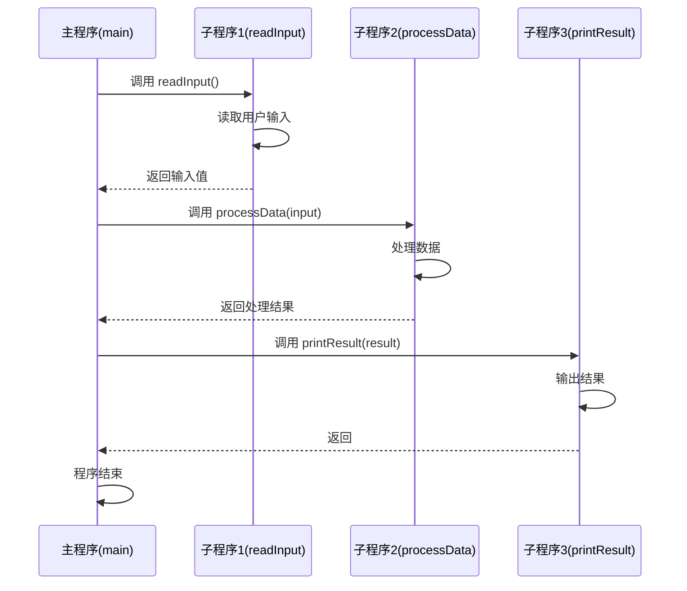
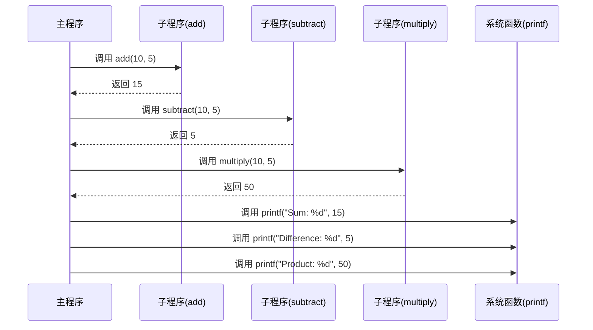

# 主程序-子程序 (Main Program and Subroutine)

## 概述

- **主程序**：控制整体流程
- **子程序**：被主程序调用，完成特定功能

**特点**：层次化调用、单线程控制、顺序执行

## 核心概念

- **主程序**：程序的入口点，负责协调和控制整个程序的执行流程
- **子程序**：被主程序调用的函数或过程，完成特定的功能模块
- **调用关系**：主程序调用子程序，子程序可以调用其他子程序，形成层次化的调用结构

## 典型示例

### 1. 传统 C 语言程序结构

```c
// 子程序：读取输入
int readInput() {
    int value;
    scanf("%d", &value);
    return value;
}

// 子程序：处理数据
int processData(int data) {
    return data * 2;
}

// 子程序：输出结果
void printResult(int result) {
    printf("Result: %d\n", result);
}

// 主程序：控制整体流程
int main() {
    int input = readInput();      // 调用子程序1
    int processed = processData(input);  // 调用子程序2
    printResult(processed);       // 调用子程序3
    return 0;
}
```

**时序图**：



### 2. 计算器程序示例

```c
// 子程序：加法
int add(int a, int b) {
    return a + b;
}

// 子程序：减法
int subtract(int a, int b) {
    return a - b;
}

// 子程序：乘法
int multiply(int a, int b) {
    return a * b;
}

// 主程序
int main() {
    int x = 10, y = 5;
    int sum = add(x, y);           // 调用加法子程序
    int diff = subtract(x, y);     // 调用减法子程序
    int product = multiply(x, y);  // 调用乘法子程序
    
    printf("Sum: %d\n", sum);
    printf("Difference: %d\n", diff);
    printf("Product: %d\n", product);
    return 0;
}
```

**时序图**（展示嵌套调用）：



## 主程序-子程序的特点

**优势**：
1. **简单直观**：程序流程清晰，易于理解
2. **易于调试**：调用关系明确，便于追踪
3. **模块化**：子程序可以独立开发和测试

**局限性**：
1. **单线程**：顺序执行，无法并行处理
2. **紧耦合**：主程序需要知道所有子程序
3. **扩展性差**：添加新功能需要修改主程序

## 与其他架构风格的区别

- **与管道过滤器**：主程序-子程序是控制流驱动，管道过滤器是数据流驱动
- **与面向对象**：主程序-子程序是过程式编程，面向对象是对象和消息传递


