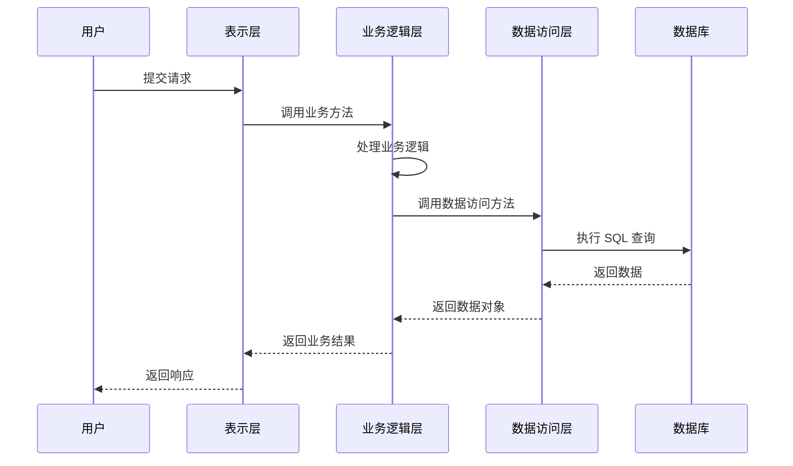
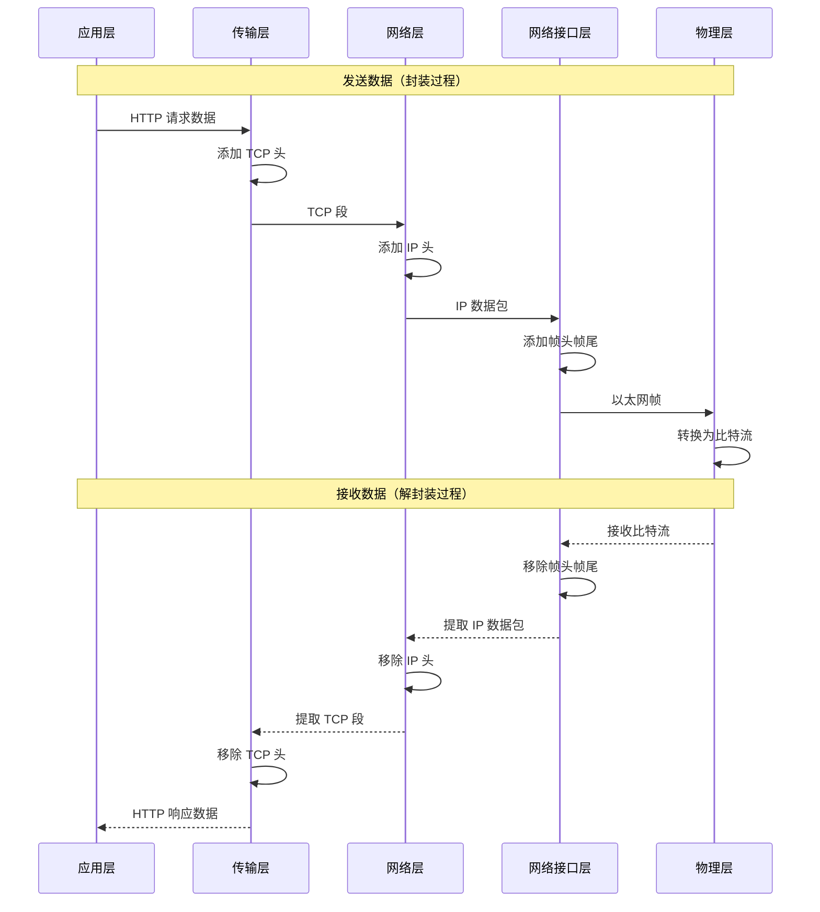

# 分层架构 (Layered Architecture)

## 概述

- 系统分为若干层，每层只与**相邻层**交互
- 上层依赖下层，下层不依赖上层

**核心原则**：
- **封装**：每层隐藏实现细节，只暴露接口
- **分层隔离**：层与层之间通过接口通信，不直接访问内部实现
- **单向依赖**：上层可以调用下层，下层不能调用上层

## 典型分层示例

### 1. 三层 Web 应用架构

```
表示层 (Presentation Layer)
    ↓
业务逻辑层 (Business Logic Layer)
    ↓
数据访问层 (Data Access Layer)
    ↓
数据库 (Database)
```

**时序图**：



### 2. OSI 七层参考模型

**OSI (Open Systems Interconnection)** 是国际标准化组织（ISO）定义的网络通信参考模型：

```
应用层 (Application Layer)        - HTTP, FTP, SMTP
表示层 (Presentation Layer)       - 数据格式转换、加密
会话层 (Session Layer)            - 建立、管理会话
传输层 (Transport Layer)          - TCP, UDP
网络层 (Network Layer)            - IP, 路由
数据链路层 (Data Link Layer)      - 帧传输、错误检测
物理层 (Physical Layer)           - 比特流传输
```

**示例系统**：ARC 网络遵循 OSI 参考模型

### 3. TCP/IP 协议栈（四层模型）

TCP/IP 是实际应用最广泛的网络协议栈，通常分为四层：

```
┌─────────────────────────────────────┐
│  应用层 (Application Layer)          │
│  HTTP, FTP, SMTP, DNS, Telnet       │
├─────────────────────────────────────┤
│  传输层 (Transport Layer)            │
│  TCP (可靠传输), UDP (快速传输)      │
├─────────────────────────────────────┤
│  网络层 (Internet Layer)             │
│  IP, ICMP, IGMP, ARP, RARP          │
├─────────────────────────────────────┤
│  网络接口层 (Network Interface)      │
│  以太网、WiFi、PPP 等                │
└─────────────────────────────────────┘
```

**各层详细说明**：

1. **应用层 (Application Layer)**
   - **功能**：为应用程序提供网络服务接口
   - **协议**：HTTP（网页浏览）、FTP（文件传输）、SMTP（邮件）、DNS（域名解析）
   - **示例**：浏览器访问网页时，应用层使用 HTTP 协议

2. **传输层 (Transport Layer)**
   - **功能**：提供端到端的数据传输服务
   - **协议**：
     - **TCP (Transmission Control Protocol)**：可靠传输，保证数据顺序和完整性
     - **UDP (User Datagram Protocol)**：快速传输，不保证可靠性
   - **示例**：HTTP 使用 TCP 协议，确保网页内容完整传输

3. **网络层 (Internet Layer)**
   - **功能**：路由和转发数据包
   - **协议**：
     - **IP (Internet Protocol)**：核心协议，负责数据包的路由
     - **ICMP (Internet Control Message Protocol)**：错误报告和诊断
     - **IGMP (Internet Group Management Protocol)**：组播管理
     - **ARP (Address Resolution Protocol)**：IP 地址到 MAC 地址的映射
     - **RARP (Reverse ARP)**：MAC 地址到 IP 地址的映射
   - **示例**：数据包从源主机路由到目标主机

4. **网络接口层 (Network Interface Layer)**
   - **功能**：处理物理网络连接
   - **技术**：以太网（Ethernet）、WiFi、PPP（点对点协议）等
   - **示例**：网卡将数据转换为电信号在网线上传输

**数据封装过程**（以发送网页请求为例）：

```
应用层：HTTP 请求数据
    ↓ 添加 TCP 头
传输层：TCP 段（包含端口号）
    ↓ 添加 IP 头
网络层：IP 数据包（包含 IP 地址）
    ↓ 添加帧头帧尾
网络接口层：以太网帧（包含 MAC 地址）
    ↓
物理传输：比特流
```

**时序图**（数据封装与解封装）：



**分层架构的优势**：

1. **关注点分离**：每层只关注自己的职责
2. **易于维护**：修改某一层不影响其他层
3. **标准化**：各层协议标准化，便于互操作
4. **可复用**：下层服务可以被多个上层使用

**分层架构的挑战**：

1. **性能开销**：数据需要经过多层封装和解封装
2. **跨层优化困难**：有时需要跨层访问以提高性能
3. **层次划分**：如何合理划分层次需要经验


