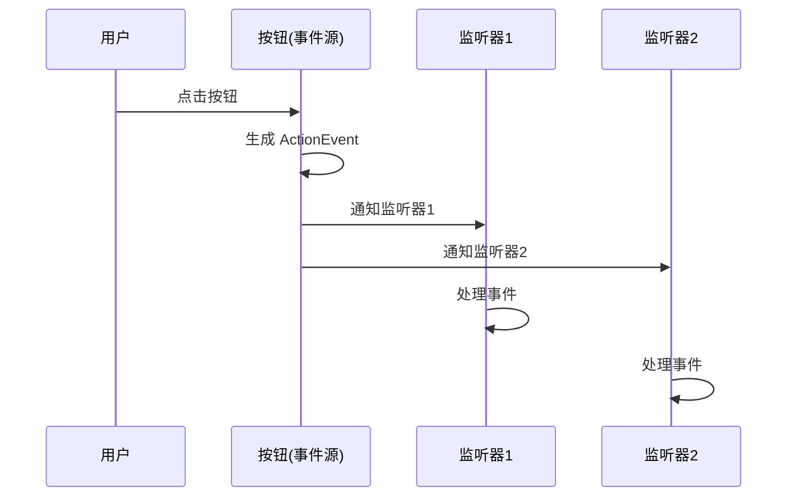
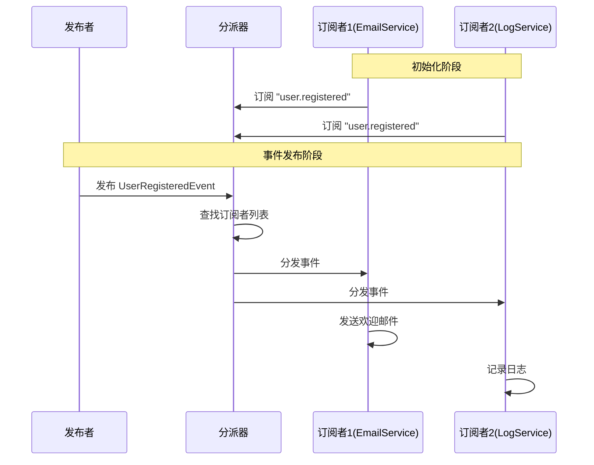
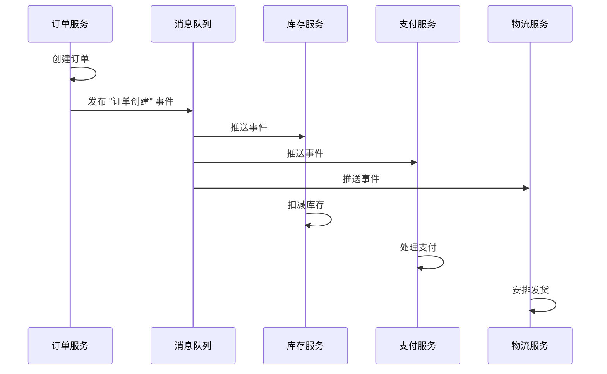

# 事件系统 (Event-Based / Implicit Invocation)

## 概述

- **事件源**：产生事件
- **事件处理器**：订阅并响应事件
- 组件之间**松耦合**，通过事件隐式调用

**核心特点**：
- **隐式调用**：组件不直接调用其他组件，而是发布事件
- **松耦合**：发布者不知道订阅者是谁，有多少个
- **异步性**：事件处理通常是异步的

## 典型示例

### 1. GUI 事件处理

图形用户界面是事件系统的典型应用：

```java
// 按钮点击事件
button.addActionListener(new ActionListener() {
    public void actionPerformed(ActionEvent e) {
        // 响应按钮点击事件
        System.out.println("Button clicked!");
    }
});
```

- **事件源**：按钮（Button）
- **事件**：点击事件（ActionEvent）
- **事件处理器**：ActionListener

**时序图**：



### 2. 发布-订阅模式 (Publish-Subscribe)

发布-订阅是事件系统的重要变体，包含**分派器 (Dispatcher)**：

**架构图**：

```
发布者 (Publisher)
    ↓ 发布事件
分派器 (Dispatcher/Event Bus)
    ↓ 分发事件
订阅者1 (Subscriber 1)
订阅者2 (Subscriber 2)
订阅者3 (Subscriber 3)
```

**代码示例**：

```java
// 事件接口
public interface Event {
    String getType();
}

// 分派器（事件总线）
public class EventDispatcher {
    private Map<String, List<Subscriber>> subscribers = new HashMap<>();
    
    // 订阅事件
    public void subscribe(String eventType, Subscriber subscriber) {
        subscribers.computeIfAbsent(eventType, k -> new ArrayList<>())
                   .add(subscriber);
    }
    
    // 发布事件
    public void publish(Event event) {
        String eventType = event.getType();
        List<Subscriber> subs = subscribers.get(eventType);
        if (subs != null) {
            for (Subscriber sub : subs) {
                sub.handle(event); // 隐式调用
            }
        }
    }
}

// 订阅者接口
public interface Subscriber {
    void handle(Event event);
}

// 具体订阅者
public class EmailService implements Subscriber {
    public void handle(Event event) {
        if (event instanceof UserRegisteredEvent) {
            // 发送欢迎邮件
            sendWelcomeEmail(((UserRegisteredEvent) event).getUser());
        }
    }
}

public class LogService implements Subscriber {
    public void handle(Event event) {
        // 记录日志
        System.out.println("Event: " + event.getType());
    }
}

// 使用示例
EventDispatcher dispatcher = new EventDispatcher();
dispatcher.subscribe("user.registered", new EmailService());
dispatcher.subscribe("user.registered", new LogService());

// 发布事件
dispatcher.publish(new UserRegisteredEvent(user));
```

**时序图**：



### 3. 观察者模式在架构中的应用

观察者模式是事件系统在对象层面的实现：

- **主题 (Subject)**：对应事件系统中的**事件源**
- **观察者 (Observer)**：对应事件系统中的**事件处理器**
- **通知机制**：对应事件系统中的**事件分发**

详见：[观察者模式](../../3-行为型模式/2-观察者模式/index.md)

**架构层面的观察者模式**：

```
Model (主题/事件源)
    ↓ 状态变化，通知观察者
View1 (观察者/事件处理器)
View2 (观察者/事件处理器)
View3 (观察者/事件处理器)
```

### 4. 消息队列系统

现代分布式系统中的事件驱动架构：

- **消息队列**：RabbitMQ, Kafka, Redis Pub/Sub
- **事件流**：事件按顺序流经系统
- **解耦**：生产者和消费者完全解耦

**示例**：订单系统

```
订单服务 (发布者)
    ↓ 发布 "订单创建" 事件
消息队列 (Kafka/RabbitMQ)
    ↓
库存服务 (订阅者) - 扣减库存
支付服务 (订阅者) - 处理支付
物流服务 (订阅者) - 安排发货
```

**时序图**：



## 事件系统的优势

1. **松耦合**：组件之间不直接依赖
2. **可扩展**：轻松添加新的事件处理器
3. **灵活性**：可以动态添加/移除订阅者
4. **异步处理**：支持异步事件处理，提高系统响应性

## 事件系统的挑战

1. **事件顺序**：多个事件的处理顺序可能不确定
2. **错误处理**：某个订阅者出错可能影响其他订阅者
3. **调试困难**：隐式调用使得调用链不直观
4. **性能**：大量事件可能导致性能问题


